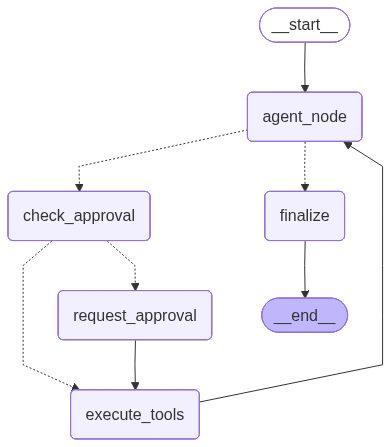
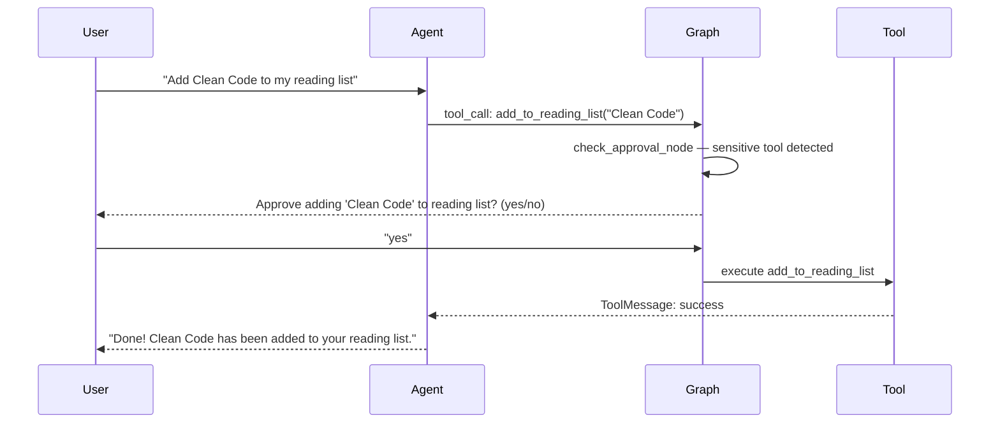

# BookMind AI — Intelligent Book Recommendation & Reading Tracker

> A conversational AI assistant powered by LangGraph, GPT-4o-mini, and the Model Context Protocol (MCP) for personalized book recommendations, reading list management, and structured reading plan generation.


---

## Table of Contents

- [Overview](#overview)
- [Features](#features)
- [Graph Workflow](#graph-workflow)
- [Project Structure](#project-structure)
- [Tech Stack](#tech-stack)
- [Getting Started](#getting-started)
- [Configuration](#configuration)
- [Tools Reference](#tools-reference)
- [State Schema](#state-schema)
- [Example Session](#example-session)

---

## Overview

BookMind AI is a terminal-based agentic assistant that helps users discover books, track their reading interests, and generate personalized reading plans. Built as a hands-on exploration of modern LLM application patterns, it demonstrates:

- **Stateful multi-turn conversations** using LangGraph's `StateGraph` with in-memory checkpointing
- **Tool-augmented reasoning** — the agent searches local book catalogs, queries external APIs, and manages user preferences
- **Human-in-the-Loop (HITL) control** — sensitive write operations require explicit user confirmation before execution
- **Model Context Protocol (MCP)** integration for extending the agent's reach to the OpenLibrary API
- **Structured output** with Pydantic-validated weekly reading plans

---

## Features

| Feature | Description |
|---|---|
| Natural Language Chat | Conversational interface powered by GPT-4o-mini |
| Book Search | Search local catalog of 50 curated books by title, author, or genre |
| OpenLibrary Integration | MCP-powered fallback to query the OpenLibrary API for any book |
| Reading List Management | Add books to a persistent in-session reading list |
| Preference Tracking | Remember favorite authors and genres across the conversation |
| Dynamic Prompting | System prompt regenerated each turn with current user context injected |
| Human-in-the-Loop | Confirm before modifying personal lists (reading list, favorites) |
| Structured Reading Plans | Generate JSON-formatted weekly reading schedules with daily page targets |
| LangSmith Tracing | Full observability for debugging and evaluation |

---

## Graph Workflow



### Node Descriptions

| Node | Role |
|---|---|
| `agent_reasoning_node` | Invokes the LLM with bound tools; extracts and stores any tool calls from the response |
| `check_approval_node` | Inspects pending tool calls — routes to the approval gate if any are flagged as sensitive |
| `request_approval_node` | Interrupts graph execution and surfaces a confirmation prompt to the user |
| `execute_tools_node` | Dispatches each tool call to the correct handler (local Python function or MCP client) |
| `finalize_node` | Resets iteration counters and prepares state for the next conversation turn |

---

## Project Structure

```
P1 lang_chain_graph_mini_project/
│
├── src/
│   ├── main.py             # Entry point — async conversation loop
│   ├── graph.py            # LangGraph StateGraph construction & compilation
│   ├── graph_utility.py    # AgentState TypedDict schema
│   ├── node.py             # All graph node implementations
│   ├── node_utility.py     # Tool dispatch helpers & dynamic prompt builder
│   ├── tool.py             # LangChain @tool definitions (local tools)
│   ├── book_mcp.py         # MCP server — OpenLibrary API integration
│   ├── constants.py        # API keys, file paths, tool/sensitive-tool lists
│   ├── prompt.py           # System prompts and tool description strings
│   ├── model.py            # Pydantic models (BookInReadingList, ReadingList)
│   ├── utility.py          # I/O helpers, validation, book search functions
│   └── .env                # Environment variables (not committed)
│
├── data/
│   ├── books.json          # Local catalog — 50 books with metadata
│   └── graph_img.png       # Graph visualization snapshots
│
├── req.txt                 # Python dependencies
└── README.md
```

---

## Tech Stack

- **LangChain + LangGraph** — agent framework and state machine
- **OpenAI GPT-4o-mini** — LLM (temperature=0)
- **Model Context Protocol** (`mcp`, `langchain-mcp-adapters`) — external tool integration
- **LangGraph `InMemorySaver`** — in-session state persistence
- **Pydantic v2** — structured output validation
- **httpx** — async HTTP client
- **LangSmith** — tracing and observability
- **python-dotenv** — environment config

---

## Getting Started

### Prerequisites

- Python 3.11+
- OpenAI API key
- LangSmith API key _(optional — for tracing)_

### Installation

```bash
# 1. Clone the repo
git clone <repo-url>
cd "P1 lang_chain_graph_mini_project"

# 2. Create and activate a virtual environment
python -m venv .venv
source .venv/bin/activate        # Windows: .venv\Scripts\activate

# 3. Install dependencies
pip install -r req.txt

# 4. Configure environment variables
# Create src/.env and fill in your keys (see Configuration section)

# 5. Run the assistant
python src/main.py
```

---

## Configuration

Create a `src/.env` file with the following variables:

```env
# Required
OPENAI_API_KEY=sk-proj-...

# Optional — enables LangSmith observability
LANGSMITH_API_KEY=lsv2_pt_...
LANGSMITH_TRACING_V2=True
LANGSMITH_ENDPOINT=https://api.smith.langchain.com
LANGSMITH_PROJECT=langgraph-book-assistant
```

---

## Tools Reference

### Local Tools

These tools operate on the in-memory book catalog and user state:

| Tool | Sensitive | Description |
|---|---|---|
| `search_for_book_info` | No | Fuzzy-search the local 50-book JSON catalog by title |
| `get_all_available_books` | No | Return the full local book catalog |
| `add_to_reading_list` | **Yes** | Add a book title to the user's reading list — requires approval |
| `add_to_favorite_authors` | **Yes** | Save an author to the user's favorites — requires approval |
| `add_to_favorite_genres` | **Yes** | Save a genre to the user's favorites — requires approval |

### MCP Tool (via OpenLibrary)

| Tool | Source | Description |
|---|---|---|
| `get_books` | `book_mcp.py` → OpenLibrary API | Search any book by title; returns top 5 results with title, author, and year |

### Human-in-the-Loop Flow



---

## State Schema

The `AgentState` TypedDict is the shared data structure that flows through every node in the graph:

```python
class AgentState(TypedDict):
    # Conversation history — auto-appended via add_messages reducer
    message: Annotated[list, add_messages]

    # Tool execution
    pending_tool_calls: list[dict]   # [{id, name, args}, ...]
    awaiting_approval: bool           # True when paused for HITL confirmation
    approval_granted: bool            # User's decision on the pending action
    iteration_count: int              # Guard against infinite loops

    # Session control
    should_exit: bool
    last_user_input: str

    # User preferences — persisted across all turns in the session
    favorite_authors: list[str]
    favorite_genres: list[str]
    reading_list: list[str]

    # Tool context
    books: list[dict]                # Loaded book catalog
```

---

## Example Session

```
You: recommend me a sci-fi book
Assistant: [searches local catalog] Here are some great sci-fi picks:
  - "Dune" by Frank Herbert (1965) — ★ 4.8 — $12.99
  - "The Martian" by Andy Weir (2011) — ★ 4.6 — $10.99

You: add Dune to my reading list
Assistant: I'd like to add "Dune" to your reading list.
  > Approve this action? (yes/no): yes
Assistant: Done! "Dune" has been added to your reading list.

You: create a reading plan for next week
Assistant:
{
  "week": 1,
  "books": [
    { "title": "Dune", "pages_per_day": 52 }
  ]
}

You: exit
```

---

_Built with LangChain, LangGraph, and the Model Context Protocol._
