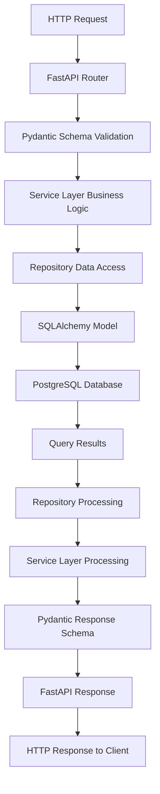
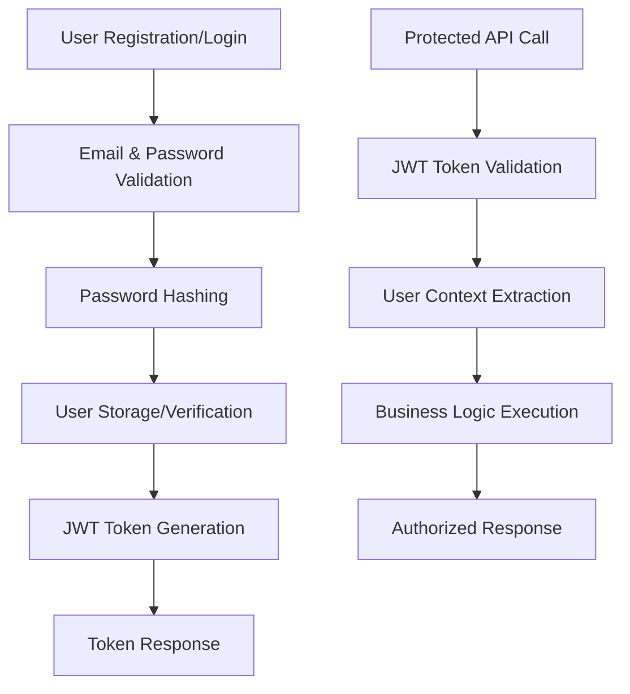
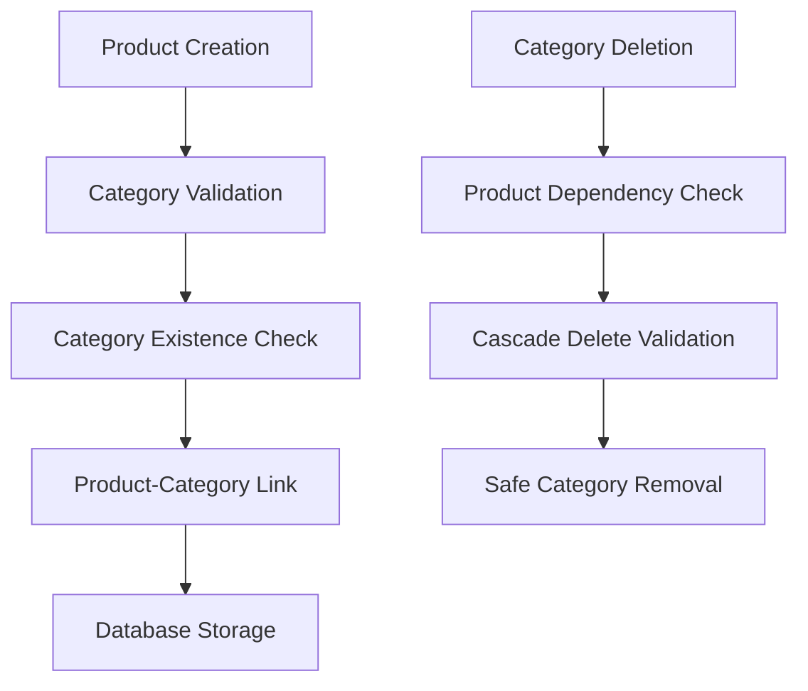

# Complete Project Workflow & Architecture Guide

**Objective:** Comprehensive guide to understanding the entire project workflow from start to end, folder importance, error handling patterns, and Pydantic validation significance.

## Table of Contents
- [Project Workflow Overview](#project-workflow-overview)
- [Folder-by-Folder Analysis](#folder-by-folder-analysis)
- [Error Handling & Validation Patterns](#error-handling--validation-patterns)
- [Pydantic Validation Deep Dive](#pydantic-validation-deep-dive)
- [Development Lifecycle](#development-lifecycle)
- [Common Issues & Troubleshooting](#common-issues--troubleshooting)

## Project Workflow Overview

### End-to-End Request Flow


### Authentication Workflow


### Product-Category Relationship Flow


## Folder-by-Folder Analysis

### 1. **`src/api/`** - HTTP Interface Layer

**Purpose:** Handle all HTTP communication and routing for inventory management

**Critical Files:**
- `main.py`: Application entry point, middleware setup, exception handlers
- `routes/user.py`: User authentication and management endpoints
- `routes/product.py`: Product CRUD operations with category relationships
- `routes/category.py`: Category management endpoints

**Common Errors & Issues:**
- **HTTP 422 Validation Errors**: Invalid product/category data format
- **HTTP 401 Unauthorized**: Missing or invalid JWT tokens  
- **HTTP 403 Forbidden**: Insufficient role permissions (admin vs staff)
- **HTTP 404 Not Found**: Product or category not found
- **HTTP 500 Internal Server Errors**: Unhandled service layer exceptions

**Validation Points:**
- Request body validation through Pydantic schemas
- JWT token format and expiration validation
- Role-based access control validation
- Product-category relationship validation

**Key Responsibilities:**
```python
# Example: Product creation endpoint
@router.post("/create", response_model=ProductResponse)
async def create_product(
    product_data: ProductCreate,  # Pydantic validation happens here
    product_service: ProductService = Depends(get_product_service),
    current_user: str = Depends(get_current_user)  # JWT validation here
):
    # Delegate to service layer - NO business logic here
    result = await product_service.create_product(product_data.model_dump(), current_user)
    return ProductResponse(**result)  # Response validation here
```

### 2. **`src/schemas/`** - Data Validation Layer

**Purpose:** Define data contracts and validation rules using Pydantic for inventory entities

**Critical Files:**
- `user.py`: User registration, login, and response schemas with role validation
- `product.py`: Product creation, update, and response schemas with category linking
- `category.py`: Category creation and management schemas
- `token.py`: JWT token schemas for authentication

**Common Errors & Issues:**
- **ValidationError**: Input data doesn't meet schema requirements
- **Type Conversion Errors**: Invalid data types in requests (e.g., price as string)
- **Missing Required Fields**: Incomplete product or category payloads
- **Field Value Errors**: Product names exceed length limits, invalid categories
- **Relationship Validation Errors**: Invalid category IDs in product requests

**Validation Categories:**
- **Format Validation**: Email format, UUID formats, price decimal format
- **Length Validation**: Product names, descriptions, category names
- **Pattern Validation**: SKU patterns, product codes
- **Business Rule Validation**: Price positivity, category hierarchy validation
- **Relationship Validation**: Category existence in product creation

**Why This Layer is Critical:**
- **Data Integrity**: Ensures consistent product and category data format
- **Business Rule Enforcement**: Validates inventory-specific constraints
- **API Documentation**: Auto-generates OpenAPI specs for inventory management
- **Type Safety**: Prevents data type mismatches in database operations

### 3. **`src/services/`** - Business Logic Layer

**Purpose:** Implement core inventory management business rules and orchestrate operations

**Structure:**
- `user_service.py`: User authentication and role management logic
- `product_service.py`: Product business rules, category validation, inventory logic
- `category_service.py`: Category management and hierarchy logic
- `models.py`: Service layer data models and DTOs

**Common Errors & Issues:**
- **Business Rule Violations**: Users trying to delete categories with products
- **Data Consistency Errors**: Concurrent product updates causing conflicts
- **Inventory Logic Errors**: Invalid stock levels, negative quantities
- **Category Hierarchy Errors**: Circular category references
- **Role-Based Access Errors**: Staff users attempting admin operations

**Error Handling Patterns:**
```python
class ProductService:
    async def create_product(self, product_data: dict, email: str) -> dict:
        try:
            # Business rule: User must exist and have appropriate role
            user = await self.user_repository.get_by_email(email)
            if not user:
                raise ValueError("User not found")
                
            # Business rule: Category must exist
            category = await self.category_repository.get_by_id(product_data["category_id"])
            if not category:
                raise ValueError("Invalid category specified")
                
            # Business rule: Validate product data
            if product_data.get("price", 0) <= 0:
                raise ValueError("Product price must be positive")
                
            # Business rule: Set ownership
            product_data["created_by"] = user["id"]
            
            return await self.product_repository.create_product(product_data)
            
        except Exception as e:
            logger.error(f"Product creation failed for user {email}: {str(e)}")
            raise
```

**Key Responsibilities:**
- Enforce inventory business rules and constraints
- Manage product-category relationships
- Handle role-based access control
- Coordinate between multiple repositories
- Implement inventory-specific workflows

### 4. **`src/repository/`** - Data Access Layer

**Purpose:** Abstract database operations and provide clean data access interface for inventory data

**Critical Files:**
- `database.py`: Database connection and session management
- `utility.py`: Repository utilities and common operations

**Common Errors & Issues:**
- **Database Connection Errors**: Connection pool exhaustion during high inventory traffic
- **Query Execution Errors**: Invalid SQL, constraint violations (duplicate SKUs)
- **Transaction Errors**: Deadlocks during concurrent inventory updates
- **Data Mapping Errors**: ORM to dict conversion issues for complex product data
- **Foreign Key Violations**: Attempting to delete categories referenced by products

**Error Handling Patterns:**
```python
class ProductRepository:
    async def create_product(self, product_data: dict) -> dict:
        try:
            async with self.get_db_session() as session:
                product = Product(**product_data)
                session.add(product)
                await session.commit()
                await session.refresh(product)
                
                return {
                    "id": product.id,
                    "name": product.name,
                    "sku": product.sku,
                    "price": float(product.price),
                    "category_id": product.category_id,
                    "created_at": product.created_at
                }
                
        except IntegrityError as e:
            await session.rollback()
            logger.error(f"Database integrity error: {str(e)}")
            if "unique" in str(e).lower():
                raise ValueError("Product with this SKU already exists")
            raise ValueError("Data integrity violation")
            
        except SQLAlchemyError as e:
            await session.rollback()
            logger.error(f"Database error: {str(e)}")
            raise RuntimeError("Database operation failed")
```

### 5. **`src/models/`** - Database Entity Layer

**Purpose:** Define inventory database table structures and relationships

**Critical Files:**
- `user.py`: User table model with role-based access control
- `product.py`: Product table model with category relationships and inventory fields
- `category.py`: Category table model for product categorization

**Common Errors & Issues:**
- **Model Validation Errors**: Invalid data types for inventory fields
- **Relationship Errors**: Foreign key violations between products and categories
- **Migration Errors**: Schema changes breaking existing inventory data
- **Performance Issues**: N+1 queries when loading products with categories
- **Constraint Violations**: Duplicate SKUs, invalid category references

**Key Responsibilities:**
- Define inventory table structures and columns
- Establish product-category relationships
- Enforce database constraints for data integrity
- Provide ORM mapping for inventory entities

### 6. **`src/core/`** - Infrastructure Layer

**Purpose:** Provide foundational services and configuration for inventory management

**Critical Files:**
- `config.py`: Environment configuration with database and JWT settings
- `database.py`: Database connection and session management
- `jwt.py`: JWT token creation and validation for user authentication
- `log.py`: Structured logging with correlation IDs for inventory operations
- `excptions.py`: Custom exception classes (WeakPasswordException)
- `app_utility.py`: Application lifecycle management
- `decorator_pattern.py`: Decorator implementations for cross-cutting concerns

**Common Errors & Issues:**
- **Configuration Errors**: Missing database credentials or JWT secrets
- **Database Connection Failures**: Connection pool issues during peak inventory traffic
- **Logging Configuration Errors**: Invalid log levels affecting inventory audit trails
- **JWT Validation Errors**: Token expiration or invalid signatures

### 7. **`alembic/`** - Database Migration Layer

**Purpose:** Manage database schema changes for inventory system evolution

**Critical Files:**
- `versions/`: Migration scripts for schema changes
- `env.py`: Migration environment configuration
- `alembic.ini`: Migration configuration settings

**Common Errors & Issues:**
- **Migration Conflicts**: Concurrent schema changes
- **Data Loss**: Improper migration scripts affecting inventory data
- **Rollback Failures**: Inability to revert problematic migrations
- **Performance Issues**: Large migrations affecting inventory availability

## Error Handling & Validation Patterns

### Centralized Error Handling

**Location:** `src/api/main.py` and `src/core/excptions.py`

**Purpose:** Provide consistent error responses across the inventory application

**Implementation:**
```python
@app.exception_handler(WeakPasswordException)
async def handle_weak_password(request: Request, error: WeakPasswordException):
    return JSONResponse(
        status_code=400, 
        content={"status": "Error", "message": error.message}
    )

@app.exception_handler(ValueError)
async def value_error_handler(request: Request, exc: ValueError):
    return JSONResponse(
        status_code=400,
        content={
            "error": "Bad Request",
            "message": str(exc),
            "timestamp": datetime.utcnow().isoformat()
        }
    )
```

### Service Layer Error Handling

**Pattern:** Catch specific exceptions and re-raise with context

```python
async def create_product(self, product_data: dict, email: str) -> dict:
    try:
        # Business logic implementation
        user = await self.user_repository.get_by_email(email)
        if not user:
            raise ValueError("User not found")
            
        # Validate category exists
        category = await self.category_repository.get_by_id(product_data["category_id"])
        if not category:
            raise ValueError("Invalid category specified")
            
        return await self.product_repository.create_product(product_data)
        
    except ValueError as e:
        # Re-raise business logic errors
        logger.warning(f"Business rule violation: {str(e)}")
        raise
        
    except Exception as e:
        # Log unexpected errors
        logger.error(f"Unexpected error in product creation: {str(e)}")
        raise RuntimeError("Product creation failed")
```

### Repository Layer Error Handling

**Pattern:** Database-specific error handling with rollback

```python
async def create_product(self, product_data: dict) -> dict:
    try:
        async with self.get_db_session() as session:
            product = Product(**product_data)
            session.add(product)
            await session.commit()
            await session.refresh(product)
            return self._model_to_dict(product)
            
    except IntegrityError as e:
        await session.rollback()
        logger.error(f"Database integrity error: {str(e)}")
        if "sku" in str(e).lower():
            raise ValueError("Product SKU already exists")
        raise ValueError("Data integrity violation")
        
    except SQLAlchemyError as e:
        await session.rollback()
        logger.error(f"Database error: {str(e)}")
        raise RuntimeError("Database operation failed")
```

## Pydantic Validation Deep Dive

### Schema Definition Best Practices

**1. Use Descriptive Field Names for Inventory**
```python
class ProductCreate(BaseModel):
    name: str = Field(..., min_length=1, max_length=200, description="Product name")
    sku: str = Field(..., min_length=3, max_length=50, description="Unique product SKU")
    description: Optional[str] = Field(None, max_length=1000, description="Product description")
    price: Decimal = Field(..., gt=0, decimal_places=2, description="Product price")
    category_id: int = Field(..., gt=0, description="Category ID")
    stock_quantity: int = Field(default=0, ge=0, description="Available stock quantity")
```

**2. Implement Custom Validators for Business Rules**
```python
class ProductCreate(BaseModel):
    sku: str = Field(..., description="Product SKU")
    price: Decimal = Field(..., gt=0, description="Product price")
    
    @field_validator('sku')
    @classmethod
    def validate_sku_format(cls, v):
        if not re.match(r'^[A-Z0-9-]+$', v):
            raise ValueError('SKU must contain only uppercase letters, numbers, and hyphens')
        return v
    
    @field_validator('price')
    @classmethod
    def validate_price_range(cls, v):
        if v > Decimal('99999.99'):
            raise ValueError('Price cannot exceed $99,999.99')
        return v
```

**3. Response Schema Optimization for Inventory**
```python
class ProductResponse(BaseModel):
    id: int
    name: str
    sku: str
    description: Optional[str]
    price: Decimal
    stock_quantity: int
    category: CategorySummary  # Nested schema for category information
    created_at: datetime
    updated_at: datetime
    
    class Config:
        from_attributes = True  # Enable ORM model conversion
```

### Validation Error Handling

**Custom Error Messages:**
```python
class CategoryCreate(BaseModel):
    name: str = Field(
        ..., 
        min_length=1, 
        max_length=100,
        error_messages={
            "min_length": "Category name cannot be empty",
            "max_length": "Category name cannot exceed 100 characters"
        }
    )
```

**Model-Level Validation:**
```python
class ProductCreate(BaseModel):
    name: str = Field(..., description="Product name")
    category_id: int = Field(..., description="Category ID")
    
    @model_validator(mode='after')
    def validate_product_data(self) -> 'ProductCreate':
        if self.name and self.category_id:
            # Additional business rule validation
            if self.name.lower() in ['deleted', 'removed', 'archived']:
                raise ValueError("Reserved product names not allowed")
        return self
```

## Development Lifecycle

### 1. **Planning Phase**
- Define inventory management requirements and endpoints
- Design product and category database schema
- Plan user roles and permissions (admin/staff)
- Establish inventory-specific error handling patterns

### 2. **Implementation Phase**
- Create inventory database models and migrations
- Implement repository layer with inventory-specific error handling
- Develop service layer with inventory business logic
- Build API endpoints with comprehensive validation
- Add inventory audit logging

### 3. **Testing Phase**
- Unit tests for each inventory layer
- Integration tests for product-category relationships
- API tests for all inventory endpoints
- End-to-end tests for complete inventory workflows

### 4. **Deployment Phase**
- Environment configuration for production
- Database migration execution with inventory data
- Application deployment with monitoring
- Inventory audit trail setup

## Common Issues & Troubleshooting

### Database Connection Issues

**Problem:** Connection pool exhaustion during high inventory traffic
**Solution:** Implement connection pooling with appropriate limits

```python
# src/repository/database.py
from sqlalchemy import create_engine
from src.core.config import settings

engine = create_engine(url=settings.DATABASE_URL)
session_local = sessionmaker(autoflush=False, autocommit=False, bind=engine)

def get_db():
    db = session_local()
    try:
        yield db
    except Exception as e:
        log_error(str(e))
        raise
    finally:
        db.close()
```

### Inventory Data Consistency

**Problem:** Concurrent product updates causing stock quantity conflicts
**Solution:** Implement optimistic locking or database-level constraints

```python
# src/models/product.py
class Product(Base):
    __tablename__ = "product"

    id: Mapped[int] = mapped_column(
        primary_key=True, unique=True, index=True, autoincrement=True
    )
    name: Mapped[str] = mapped_column(String(100), nullable=False)
    quantity: Mapped[int] = mapped_column(nullable=False)
    price: Mapped[float] = mapped_column(nullable=False)
    price_type: Mapped[str] = mapped_column(
        String(50), nullable=False, server_default="regular"
    )
    category_id: Mapped[int] = mapped_column(
        ForeignKey("product_category.id", ondelete="CASCADE"), nullable=False
    )
```

### Category-Product Relationship Issues

**Problem:** Attempting to delete categories with associated products
**Solution:** Implement cascade delete validation and proper foreign key constraints

```python
# src/services/category_service.py
def get_category_by_id(category_id: int, db: Session) -> Category | None:
    """
    Gets category by id
    
    Args:
        category_id: category id to search db
        db: database instance in session
    
    Returns:
        returns category object if exists else None
    """
    logger.debug(f"Fetching category by id: {category_id}")
    return db.query(Category).filter_by(id=category_id).first()

def handle_missing_category(category_id: int):
    """
    Log and return response for missing category
    
    Args:
        category_id: missing category's id
    
    Returns:
        dict: response describing missing category
    """
    message = f"Cannot find category with id: {category_id}"
    log_error(message)
    return {
        "status": ResponseStatus.E.value,
        "message": {"response": message},
    }
```

### Validation Error Debugging

**Problem:** Complex inventory validation errors hard to debug
**Solution:** Implement detailed error logging with context

```python
# src/api/main.py
@app.exception_handler(WeakPasswordException)
async def handle_weak_password(request: Request, error: WeakPasswordException):
    return JSONResponse(
        status_code=400, 
        content={"status": "Error", "message": error.message}
    )

# src/services/category_service.py
def check_existing_category_using_name(category: BaseCategory, db: Session):
    """
    checks db if category exists by name
    
    Args:
        category: category pydantic model
        db: database instance in session
    
    Raises:
        HTTPException: if no category in db
    """
    existing_category = get_category_by_name(category_name=category.name, db=db)
    if existing_category is not None:
        message = f"Category with name - {category.name} - already exists in db"
        log_error(message=message)
        raise HTTPException(
            status_code=status.HTTP_400_BAD_REQUEST, detail={"message": message}
        )
```

### Performance Issues with Inventory Queries

**Problem:** N+1 query problems when loading products with categories
**Solution:** Use eager loading and query optimization

```python
# src/repository/database.py
def add_commit_refresh_db(object: BaseModel, db: Session):
    """
    add, commit and refresh db after adding a row
    
    Args:
        object: to insert to db (pydantic model instance)
        db: database instance in session
    """
    db.add(object)
    db.commit()
    db.refresh(object)

# src/services/category_service.py
def get_category_by_name(category_name: str, db: Session) -> Category | None:
    """
    Gets category (db object) using name
    
    Args:
        category_name: name of category to look for
        db: database instance in session
    
    Returns:
        category from db if exists else None
    """
    logger.debug(f"Fetching category by name: {category_name}")
    existing_category = (
        db.query(Category).filter(Category.name == category_name).first()
    )
    return existing_category if existing_category else None
```

### JWT Token Management

**Problem:** Token expiration during long inventory operations
**Solution:** Implement token refresh mechanism and proper expiration handling

```python
# src/core/jwt.py
def create_access_token(data: dict, expires_delta: Optional[timedelta] = None) -> str:
    """
    Creates a JWT token with user data
    
    Args:
        data: user's data (eg: name, email)
        expires_delta: token expiry time. Defaults to None.
    """
    to_encode = data.copy()
    to_encode["exp"] = get_expiration_time(expires_delta=expires_delta)
    
    logger.info(f"To encode: {to_encode}")
    encode_jwt = jwt.encode(to_encode, settings.JWT_SECRET_KEY, settings.ALGORITHM)
    return encode_jwt

def get_expiration_time(expires_delta: timedelta | None) -> datetime:
    """
    gets expiration time for jwt token,
    calcualted based on param or set to 30 from current time
    
    Args:
        expires_delta: expiration duration for jwt
    
    Returns:
        datetime: result jwt expiration timestamp
    """
    if expires_delta:
        return datetime.now() + expires_delta
    else:
        return datetime.now() + timedelta(minutes=30)
```

### Logging Configuration for Inventory

**Problem:** Inconsistent log levels affecting inventory audit trails
**Solution:** Environment-based logging configuration with correlation IDs

```python
# src/core/log.py
def setup_logging():
    log_level = log_settings.LOG_LEVEL
    
    # Displayed in log console
    processors = [
        structlog.contextvars.merge_contextvars,
        add_context_processor,
        structlog.processors.add_log_level,
        structlog.processors.CallsiteParameterAdder(
            {
                structlog.processors.CallsiteParameter.LINENO,
                structlog.processors.CallsiteParameter.PATHNAME,
            }
        ),
        structlog.processors.TimeStamper(fmt="iso"),
        structlog.processors.StackInfoRenderer(),
        structlog.dev.set_exc_info,
    ]
    
    # TO LOG AS JSON
    # processors.append(structlog.processors.JSONRenderer())
    # TO LOG IN CONSOLE
    processors.append(structlog.dev.ConsoleRenderer())
    
    structlog.configure(
        processors=processors,
        wrapper_class=structlog.make_filtering_bound_logger(log_level),
        logger_factory=structlog.WriteLoggerFactory(),
        cache_logger_on_first_use=True,
    )

def get_logger(name: str):
    return structlog.get_logger(name)

```

This comprehensive workflow guide provides the foundation for understanding how all inventory management components work together to create a robust, maintainable, and scalable application architecture.
