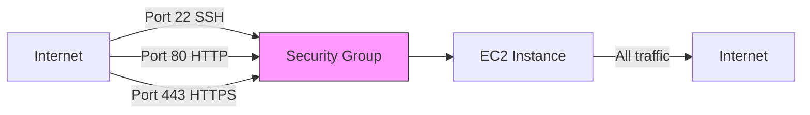
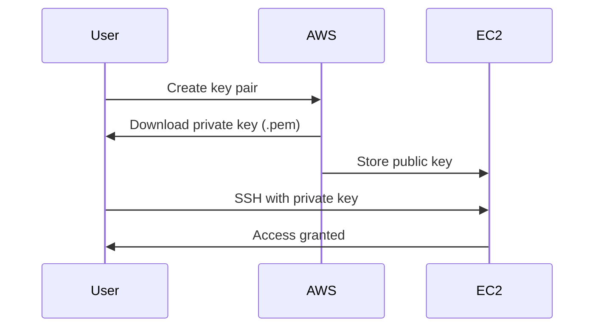
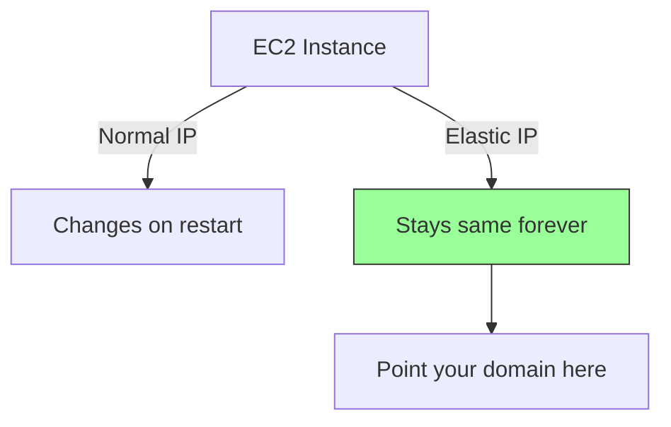
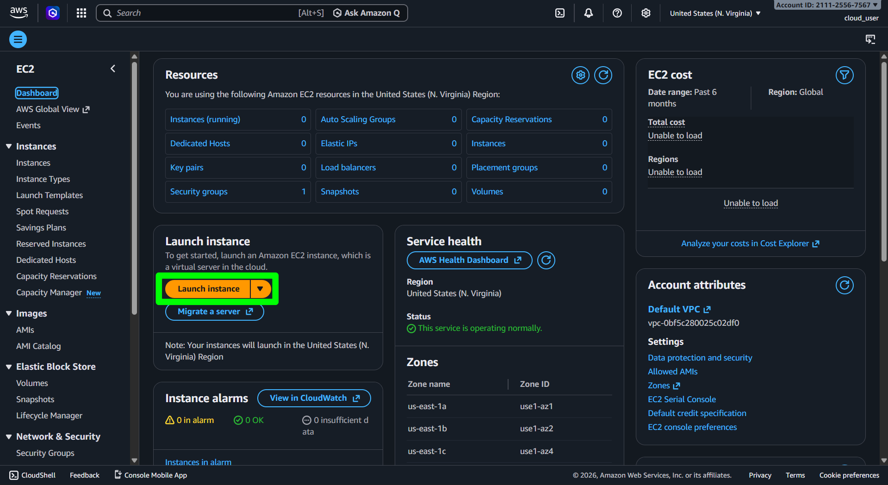
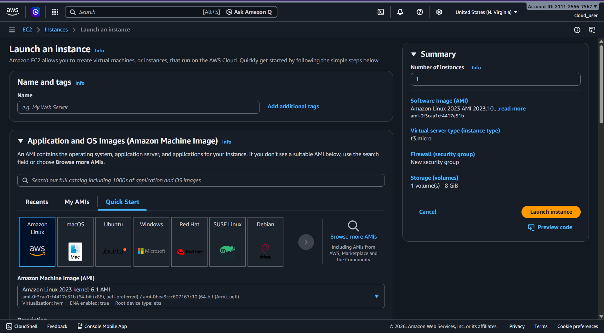
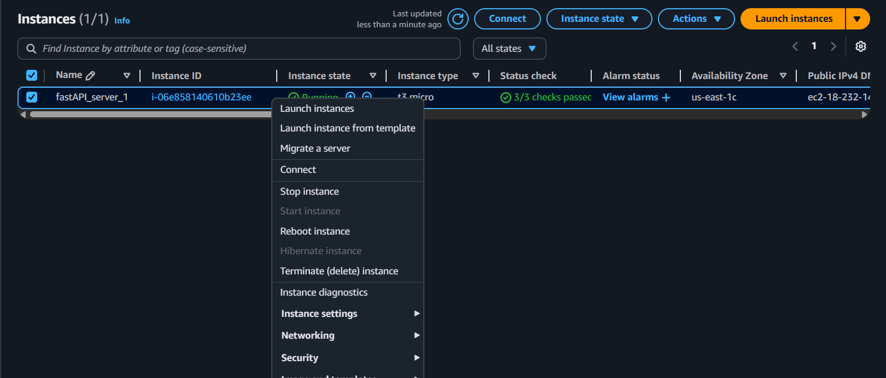

# EC2 - Elastic Compute Cloud

**EC2 is a virtual server in AWS.** Think of it as renting a computer in the cloud that you can configure and control remotely.

**What EC2 provides:**
- Virtual machines (EC2 instances)
- Storage (EBS volumes)
- Load balancing (ELB)
- Auto-scaling (ASG)

---

## Core Concepts

### 1. Instance Types

EC2 instances come in different types optimized for different workloads. Each type has a naming pattern: `<family><generation>.<size>`

**Common families:**

| Type | Use Case | Example |
|------|----------|---------|
| **t2/t3** | General purpose, burstable CPU | `t2.micro` - Web servers, small apps |
| **m5** | Balanced compute/memory/network | `m5.large` - App servers, databases |
| **c5** | Compute-optimized | `c5.xlarge` - High-performance computing, gaming |
| **r5** | Memory-optimized | `r5.large` - In-memory databases, caching |

**For beginners:** Start with `t2.micro` (free tier eligible) for testing and small applications.

### 2. Security Groups

Security groups are **virtual firewalls** that control traffic to/from your EC2 instance.

**Key concepts:**
- **Inbound rules**: Control incoming traffic TO your instance
- **Outbound rules**: Control outgoing traffic FROM your instance
- Default: All outbound allowed, all inbound blocked

**Example rules:**



**Common inbound rules:**
- SSH (Port 22): Access terminal
- HTTP (Port 80): Web traffic
- HTTPS (Port 443): Secure web traffic
- Custom TCP (e.g., 8000): Your application port

**Important:** Only open ports you need. Restrict SSH to your IP address for security.

### 3. Key Pairs and SSH Access

**Key pairs** are used to securely connect to your EC2 instance via SSH.



**How it works:**
1. AWS generates a key pair (public + private)
2. Public key → stored on EC2 instance
3. Private key → downloaded to your computer (`.pem` file)
4. You use the private key to authenticate

**Connecting via SSH:**
```bash
# Make key file read-only (required)
chmod 400 my-key.pem

# Connect to instance
ssh -i my-key.pem ubuntu@<PUBLIC_IP>
```

**Important:** Never share or lose your `.pem` file. You can't download it again.

### 4. Elastic IPs

**Problem:** EC2 instances get a new public IP every time they restart.

**Solution:** Elastic IP - a static public IP address you can attach to your instance.



**Key points:**
- Free when attached to a running instance
- Charged when NOT attached (to discourage waste)
- You own it until you release it
- Use case: When you need a permanent IP (e.g., for DNS)

### 5. Stop vs Terminate

Understanding the difference saves you from data loss and unexpected bills.

| Action | What Happens | Billing | Data |
|--------|--------------|---------|------|
| **Stop** | Instance powers off (like shutdown) | Only storage charges | **Data preserved** |
| **Terminate** | Instance deleted permanently | No charges | **Data lost** |


**When to use:**
- **Stop**: When you'll use the instance again (saves money)
- **Terminate**: When you're completely done (cleanup)

---

## Hands-On: Deploy a FastAPI Application

### 1. Launch Instance

<details>
<summary><strong>Click 'Launch instance' from EC2 dashboard</strong></summary>



</details>

### 2. Configure Instance

<details>
<summary><strong>Configure these settings</strong></summary>

**Required configuration:**
- **Name**: `my-fastapi-server`
- **AMI**: Ubuntu Server (free tier)
- **Instance type**: `t2.micro`
- **Key pair**: Create new or select existing
- **Security group**: Allow SSH (22), HTTP (80), Custom TCP (8000)



</details>

### 3. Connect via SSH

```bash
# Connect to your instance
ssh -i your-key.pem ubuntu@<PUBLIC_IP>

# Update system
sudo apt update && sudo apt upgrade -y

# Install Python and dependencies
sudo apt install python3-pip python3-venv -y

# Clone/upload your FastAPI app
git clone <your-repo-url>
cd <your-app-directory>

# Create virtual environment
python3 -m venv venv
source venv/bin/activate

# Install dependencies
pip install -r requirements.txt

# Test run
uvicorn main:app --host 0.0.0.0 --port 8000
```

Access your app at: `http://<PUBLIC_IP>:8000`

### 4. Run App as a Service (Persistent)

Create a systemd service to keep your app running even after you disconnect.

```bash
# Create service file
sudo vim /etc/systemd/system/fastapi.service
```

Add this configuration:

```ini
[Unit]
Description=FastAPI Application
After=network.target

[Service]
User=ubuntu
Group=ubuntu
WorkingDirectory=/home/ubuntu/<your-app-directory>
ExecStart=/home/ubuntu/<your-app-directory>/venv/bin/uvicorn main:app --host 0.0.0.0 --port 8000
Restart=always

[Install]
WantedBy=multi-user.target
```

Start the service:

```bash
sudo systemctl daemon-reload
sudo systemctl start fastapi
sudo systemctl enable fastapi  # Auto-start on boot
sudo systemctl status fastapi  # Check status
```

### 5. Stop or Terminate

**When done testing:**
- **Stop** the instance to save money (data preserved)
- **Terminate** when completely finished (permanent deletion)

<details>
<summary><strong>Right-click instance → Select action</strong></summary>



</details>

**⚠️ Important:** Running instances cost money. Always stop/terminate when not in use.

---

## Resources

### Video Tutorials
- [Hosting FastAPI application in EC2](https://www.youtube.com/watch?v=SgSnz7kW-Ko) - Step-by-step deployment guide
- [AWS EC2 Tutorial for Beginners](https://www.youtube.com/watch?v=iHX-jtKIVNA) - Complete EC2 walkthrough
- [EC2 Instance Types Explained](https://www.youtube.com/watch?v=1XKy6W0M3bA) - Choosing the right instance

### Blog Posts & Guides
- [EC2 for Beginners - freeCodeCamp](https://www.freecodecamp.org/news/aws-ec2-tutorial-for-beginners/) - Comprehensive beginner guide
- [Understanding Security Groups](https://medium.com/@sanketbajoria/aws-security-groups-explained-45f4a6f2e5a4) - Deep dive into security groups
- [EC2 Instance Types Cheat Sheet](https://instances.vantage.sh/) - Interactive instance comparison tool
- [SSH to EC2 Made Simple](https://dev.to/aws-builders/how-to-ssh-into-ec2-instance-2gd9) - Troubleshooting SSH connection issues
- [Stop vs Terminate EC2 Instances](https://jayendrapatil.com/aws-ec2-instance-lifecycle/) - Understanding instance states

### Interactive Tools
- [EC2 Instance Pricing Calculator](https://calculator.aws/) - Calculate costs before deployment
- [EC2Instances.info](https://instances.vantage.sh/) - Compare all instance types side-by-side

### Best Practices
- [AWS EC2 Security Best Practices](https://www.trendmicro.com/en_us/devops/21/k/aws-ec2-security-best-practices.html) - Security hardening guide
- [Cost Optimization Tips](https://aws.plainenglish.io/10-ways-to-reduce-your-aws-ec2-costs-d6c6b5e0e4f7) - Save money on EC2
