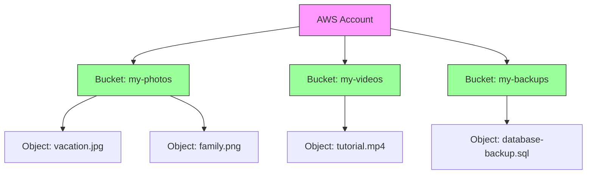
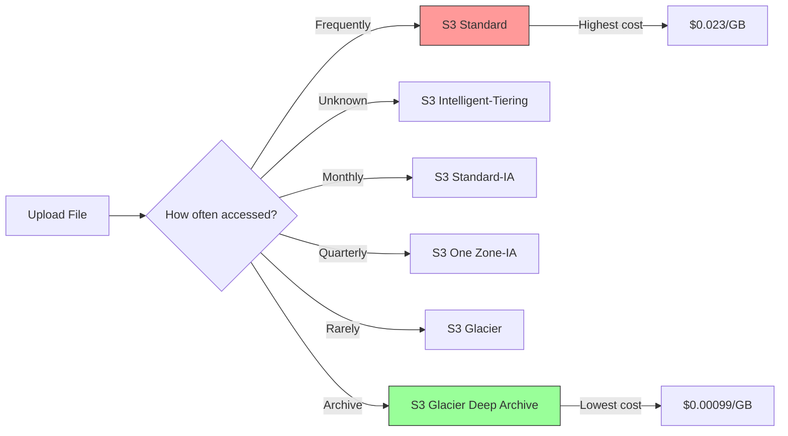
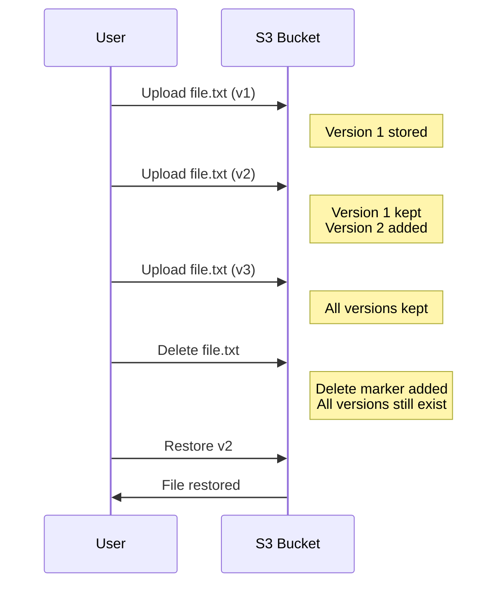
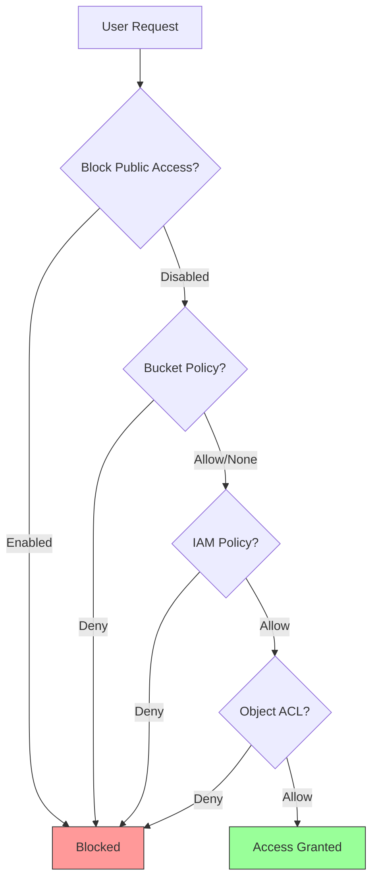
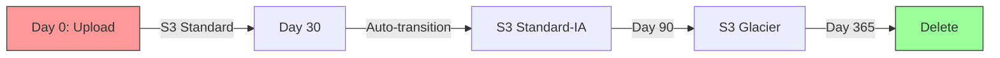

# S3 - Simple Storage Service

**S3 is AWS's object storage service.** Think of it as a massive, secure hard drive in the cloud where you can store any type of file and access it from anywhere.

**What S3 provides:**
- Unlimited storage space (pay for what you use)
- 99.999999999% (11 nines) data durability
- Built-in versioning and backup
- Web-accessible files with unique URLs
- Integration with other AWS services

---

## Core Concepts

### 1. Buckets and Objects



**Bucket:**
- A container for objects (like a top-level folder)
- Must have a globally unique name across ALL AWS accounts
- Name must be DNS-compliant (lowercase, no spaces)
- Example: `my-app-images-2024` ✓ | `My App Images` ✗

**Object:**
- Any file you store in a bucket (images, videos, documents, code, etc.)
- Each object has:
  - **Key**: The file path/name (e.g., `photos/2024/vacation.jpg`)
  - **Value**: The actual file data
  - **Metadata**: Additional information (content type, custom tags)
- Maximum size: 5 TB per object

**Folder structure:**
S3 doesn't actually have folders, but uses **key prefixes** to simulate them:
- `photos/2024/vacation.jpg` - Looks like a folder structure
- `photos/` is just part of the key name

### 2. Storage Classes

Storage classes let you optimize cost based on how often you access your files.



| Storage Class | Access Frequency | Retrieval Time | Use Case | Cost |
|---------------|------------------|----------------|----------|------|
| **S3 Standard** | Frequent | Instant | Active data, websites | Highest |
| **S3 Intelligent-Tiering** | Changing/Unknown | Instant | Data with unpredictable patterns | Auto-optimized |
| **S3 Standard-IA** | Infrequent (monthly) | Instant | Backups, old content | Lower |
| **S3 One Zone-IA** | Infrequent, non-critical | Instant | Easily reproducible data | Lower |
| **S3 Glacier Instant** | Rarely, needs instant access | Instant | Medical records, archives | Low |
| **S3 Glacier Flexible** | Rarely (yearly) | Minutes to hours | Long-term archives | Very low |
| **S3 Glacier Deep Archive** | Almost never (multi-year) | 12-48 hours | Compliance archives | Lowest |

**For beginners:** Start with **S3 Standard** for active files and **S3 Intelligent-Tiering** when unsure.

### 3. Versioning

Versioning keeps multiple versions of an object to protect against accidental deletion or overwrites.



**How it works:**
- **Enabled**: Each upload creates a new version (v1, v2, v3...)
- **Disabled**: New file replaces the old one (default behavior)
- **Deleting**: Adds a "delete marker" instead of removing the file
- **Restoring**: You can retrieve any previous version

**Benefits:**
- Recover from accidental deletion
- Roll back to previous versions
- Track changes over time

**Costs:**
- You pay for storage of ALL versions
- Use lifecycle policies to delete old versions automatically

### 4. Access Control & Security

S3 provides multiple layers of security to control who can access your files.



**Security mechanisms:**

1. **Block Public Access** (Recommended for beginners)
   - Default: All buckets are private
   - Settings prevent accidental public exposure
   - Keep this ON unless you need a public website

2. **Bucket Policies** (JSON-based permissions)
   ```json
   {
     "Version": "2012-10-17",
     "Statement": [{
       "Effect": "Allow",
       "Principal": "*",
       "Action": "s3:GetObject",
       "Resource": "arn:aws:s3:::my-bucket/*"
     }]
   }
   ```
   - Grant permissions at bucket level
   - Use for: Making files public, cross-account access

3. **IAM Policies** (User/role permissions)
   - Control what AWS users can do with S3
   - Best practice for team access management

4. **Access Control Lists (ACLs)** (Legacy, avoid if possible)
   - Object-level permissions
   - Use bucket policies instead

**Best practice:** Use IAM policies for users, bucket policies for public access, and keep Block Public Access ON by default.

### 5. Encryption

Protect your data at rest and in transit.

| Encryption Type | Description | When to Use |
|-----------------|-------------|-------------|
| **SSE-S3** | AWS manages keys automatically | Default choice (free) |
| **SSE-KMS** | AWS KMS keys (you control) | Compliance, audit trail |
| **SSE-C** | You provide and manage keys | Full control needed |
| **Client-Side** | Encrypt before uploading | Maximum security |

**For beginners:** Use **SSE-S3** (enabled by default) - AWS handles everything automatically.

### 6. Lifecycle Policies

Automatically transition or delete objects based on rules to save costs.



**Example lifecycle rule:**
1. Store in S3 Standard for 30 days (active use)
2. Move to S3 Standard-IA after 30 days (less access)
3. Move to Glacier after 90 days (archive)
4. Delete after 365 days (cleanup)

**Common use cases:**
- Delete log files after 30 days
- Archive backups to Glacier after 90 days
- Remove old versions after 180 days

---

## Setup & Usage

### 1. Create a Bucket

**Via AWS Console:**
1. Go to S3 dashboard → Click **"Create bucket"**
2. Enter a unique bucket name (e.g., `myapp-storage-2024`)
3. Choose region (closest to your users for speed)
4. **Block all public access**: Keep checked (recommended)
5. Enable **Bucket Versioning**: Optional but recommended
6. Click **"Create bucket"**


### 2. Configure AWS CLI

**Install AWS CLI:**
```bash
# Windows (PowerShell)
msiexec.exe /i https://awscli.amazonaws.com/AWSCLIV2.msi

# macOS
brew install awscli

# Linux
curl "https://awscli.amazonaws.com/awscli-exe-linux-x86_64.zip" -o "awscliv2.zip"
unzip awscliv2.zip
sudo ./aws/install
```

**Configure credentials:**
```bash
aws configure
# Enter:
# - AWS Access Key ID
# - AWS Secret Access Key
# - Default region (e.g., us-east-1)
# - Default output format (json)
```

### 3. Upload & Download Files

**Via AWS CLI:**
```bash
# Upload a single file
aws s3 cp myfile.txt s3://my-bucket/

# Upload with folder structure
aws s3 cp myfile.txt s3://my-bucket/docs/2024/

# Upload entire directory
aws s3 cp ./local-folder s3://my-bucket/ --recursive

# Download a file
aws s3 cp s3://my-bucket/myfile.txt ./

# Download entire bucket
aws s3 sync s3://my-bucket/ ./local-folder/

# List bucket contents
aws s3 ls s3://my-bucket/

# Delete a file
aws s3 rm s3://my-bucket/myfile.txt
```

### 4. Using Python (boto3)

**Install boto3:**
```bash
# In your virtual environment
pip install boto3[crt]
```

**Basic operations:**
```python
import boto3

# Create S3 client (uses AWS CLI credentials)
s3 = boto3.client('s3')

# Upload file
s3.upload_file('local-file.txt', 'my-bucket', 'remote-file.txt')

# Download file
s3.download_file('my-bucket', 'remote-file.txt', 'local-file.txt')

# List objects in bucket
response = s3.list_objects_v2(Bucket='my-bucket')
for obj in response.get('Contents', []):
    print(obj['Key'], obj['Size'], obj['LastModified'])

# Generate presigned URL (temporary public link)
url = s3.generate_presigned_url(
    'get_object',
    Params={'Bucket': 'my-bucket', 'Key': 'file.txt'},
    ExpiresIn=3600  # Valid for 1 hour
)
print(f"Temporary URL: {url}")

# Delete object
s3.delete_object(Bucket='my-bucket', Key='file.txt')
```

**Advanced example with versioning:**
```python
# Upload file and get version ID
response = s3.put_object(
    Bucket='my-bucket',
    Key='versioned-file.txt',
    Body='Content version 1'
)
version_id = response['VersionId']

# Retrieve specific version
obj = s3.get_object(
    Bucket='my-bucket',
    Key='versioned-file.txt',
    VersionId=version_id
)
content = obj['Body'].read().decode('utf-8')

# List all versions
versions = s3.list_object_versions(Bucket='my-bucket')
for version in versions.get('Versions', []):
    print(f"{version['Key']} - Version: {version['VersionId']}")
```

### 5. Static Website Hosting

Host a static website directly from S3 (HTML, CSS, JS).

```bash
# Enable website hosting
aws s3 website s3://my-bucket/ \
    --index-document index.html \
    --error-document error.html

# Upload website files
aws s3 sync ./website-folder s3://my-bucket/ --acl public-read
```

**Make bucket public for website:**
```json
{
  "Version": "2012-10-17",
  "Statement": [{
    "Sid": "PublicReadGetObject",
    "Effect": "Allow",
    "Principal": "*",
    "Action": "s3:GetObject",
    "Resource": "arn:aws:s3:::my-bucket/*"
  }]
}
```

**Access your website:**
- URL format: `http://my-bucket.s3-website-us-east-1.amazonaws.com`

### 6. Delete Bucket

**Important:** Buckets must be empty before deletion.

```bash
# Delete all objects (including versions)
aws s3 rm s3://my-bucket/ --recursive

# If versioning enabled, delete all versions
aws s3api delete-objects \
    --bucket my-bucket \
    --delete "$(aws s3api list-object-versions \
    --bucket my-bucket \
    --query '{Objects: Versions[].{Key:Key,VersionId:VersionId}}' \
    --max-items 1000)"

# Delete bucket
aws s3 rb s3://my-bucket/
```

**Via Python:**
```python
import boto3

s3 = boto3.resource('s3')
bucket = s3.Bucket('my-bucket')

# Delete all objects and versions
bucket.object_versions.all().delete()

# Delete bucket
bucket.delete()
```

---

## Common Use Cases

### 1. Application File Storage
Store user uploads (profile pictures, documents, videos)

**Example:**
```python
# FastAPI file upload to S3
from fastapi import FastAPI, UploadFile
import boto3

app = FastAPI()
s3 = boto3.client('s3')

@app.post("/upload/")
async def upload_file(file: UploadFile):
    s3.upload_fileobj(
        file.file,
        'my-app-uploads',
        f"users/{file.filename}"
    )
    return {"message": "File uploaded successfully"}
```

### 2. Static Website Hosting
Host HTML/CSS/JS websites (React, Vue, Angular builds)

### 3. Backup & Disaster Recovery
Automated backups of databases, logs, or critical files

### 4. Data Lakes & Analytics
Store large datasets for processing with AWS Athena, EMR, or Redshift

### 5. Content Distribution
Serve images, videos, downloads with CloudFront CDN

### 6. Log Storage
Store application logs with lifecycle policies for automatic cleanup

---

## Best Practices

### Security
- ✅ Enable **Block Public Access** by default
- ✅ Use **IAM roles** instead of access keys when possible
- ✅ Enable **encryption** (SSE-S3 minimum)
- ✅ Use **presigned URLs** for temporary access
- ✅ Enable **MFA Delete** for critical buckets
- ❌ Never hardcode AWS credentials in code
- ❌ Avoid making entire buckets public

### Cost Optimization
- ✅ Use **Intelligent-Tiering** for unpredictable access patterns
- ✅ Set up **lifecycle policies** to transition/delete old data
- ✅ Delete **incomplete multipart uploads** (can accumulate costs)
- ✅ Enable **S3 Storage Lens** to analyze usage
- ❌ Don't store data in Standard if rarely accessed

### Performance
- ✅ Use **S3 Transfer Acceleration** for global uploads
- ✅ Enable **multipart upload** for files >100MB
- ✅ Use **prefixes** to organize objects (e.g., `year/month/day/`)
- ✅ Consider **CloudFront CDN** for frequently accessed files

### Reliability
- ✅ Enable **versioning** for critical data
- ✅ Set up **cross-region replication** for disaster recovery
- ✅ Use **S3 Object Lock** for compliance (WORM - Write Once Read Many)
- ✅ Monitor with **CloudWatch** and **S3 Event Notifications**

---

## Resources

### Official AWS Documentation
- [Boto3 S3 Documentation](https://boto3.amazonaws.com/v1/documentation/api/latest/reference/services/s3.html) - Python SDK reference
- [AWS CLI S3 Commands](https://awscli.amazonaws.com/v2/documentation/api/latest/reference/s3/index.html) - CLI command reference

### Video Tutorials
- [AWS S3 Basics - Complete Tutorial](https://www.youtube.com/watch?v=lKPnz27rCPQ) - 20-minute beginner guide
- [Building a Static Website on S3](https://www.youtube.com/watch?v=RoY3ekCCxKc) - Host websites on S3

### Blog Posts & Guides
- [S3 Cost Optimization Guide](https://www.cloudzero.com/blog/s3-cost-optimization) - Save money on S3

### Interactive Tools
- [S3 Pricing Calculator](https://calculator.aws/#/addService/S3) - Estimate your S3 costs
- [S3 Storage Classes Comparison](https://aws.amazon.com/s3/storage-classes/) - Official comparison chart
- [S3 Bucket Policy Generator](https://awspolicygen.s3.amazonaws.com/policygen.html) - Create bucket policies visually

### Cheat Sheets & Quick References
- [Boto3 S3 Examples](https://boto3.amazonaws.com/v1/documentation/api/latest/guide/s3-examples.html) - Python code snippets
- [S3 Best Practices Checklist](https://docs.aws.amazon.com/AmazonS3/latest/userguide/security-best-practices.html) - AWS security checklist

### Books & Courses
- [AWS Certified Solutions Architect Course](https://www.udemy.com/course/aws-certified-solutions-architect-associate-saa-c03/) - Udemy (includes S3)
