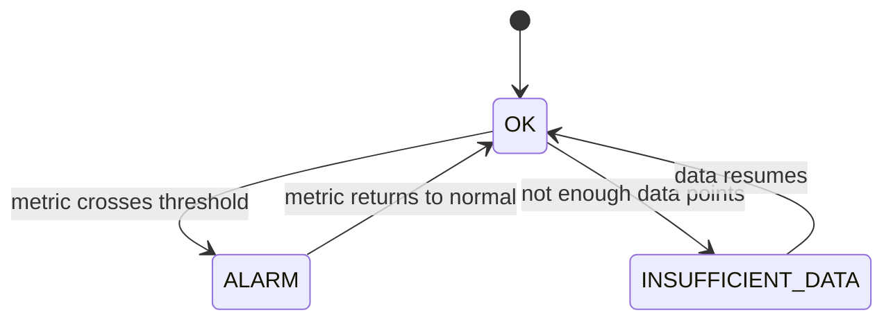
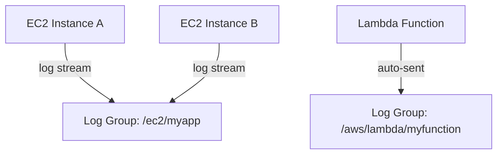
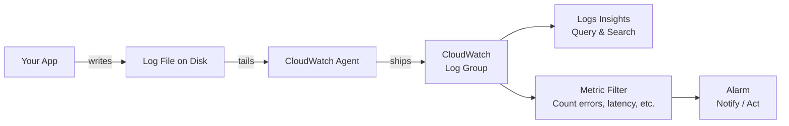
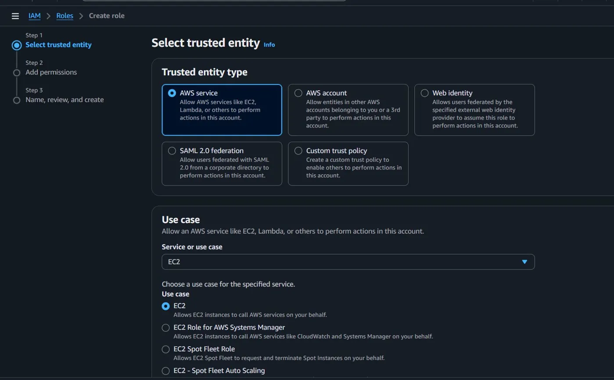
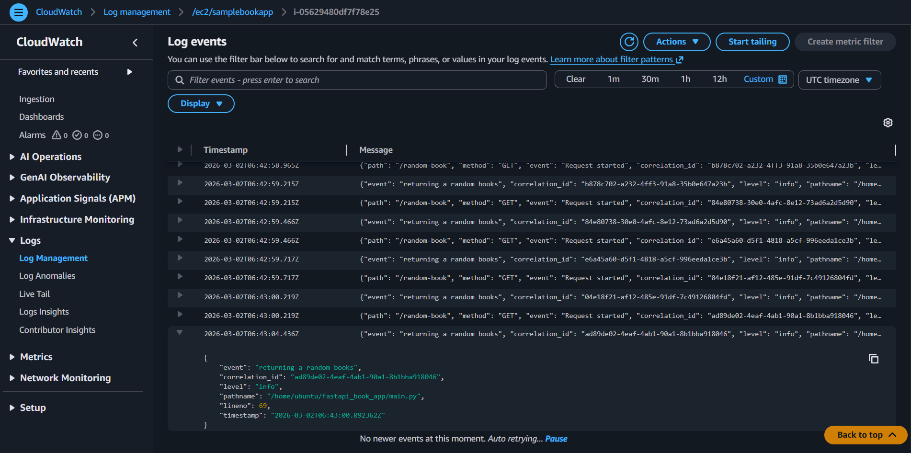
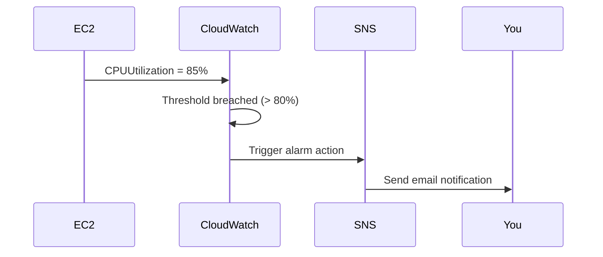

# CloudWatch

**CloudWatch is AWS's monitoring and observability service.** It collects logs, metrics, and events from your AWS infrastructure and applications, giving you visibility into what's happening so you can detect and respond to problems.

---

## Core Concepts

### Metrics
A **metric** is a time-series variable being measured — CPU usage, request count, error rate, etc. AWS services emit metrics automatically; you can also publish custom ones from your application.

### Dimensions
A **dimension** is a name/value pair that filters a metric down to a specific resource.

> **Example:** `CPUUtilization` for `InstanceId=i-1234567890` — the instance ID is the dimension. Without it, you'd see CPU aggregated across all instances, which is rarely useful.

### Statistics
A **statistic** is a mathematical aggregation applied to a metric over a time window — `Average`, `Sum`, `Min`, `Max`, `p99`, etc.

### Alarms
An **alarm** watches a metric over time and triggers an action when it crosses a threshold.



**What alarms can trigger:**
- SNS notification (email, SMS, webhook)
- Stop, reboot, or terminate an EC2 instance
- Auto Scaling action

### Logs

| Concept | Description |
|---------|-------------|
| **Log Event** | A single timestamped line from your app |
| **Log Stream** | Sequence of log events from one source (one EC2 instance, one Lambda invocation) |
| **Log Group** | Collection of log streams from the same application or service |



> Lambda automatically sends its output to CloudWatch — no agent needed. EC2 requires the CloudWatch Agent (see hands-on below).

---

## How CloudWatch Works



1. **Collect** — your app writes logs to disk; the CloudWatch Agent ships them to CloudWatch
2. **Monitor** — logs are stored in Log Groups; AWS services emit metrics automatically
3. **Analyse** — use **Logs Insights** to query logs with a SQL-like language
4. **Act** — alarms fire when metrics breach thresholds and trigger notifications or automated responses

---

## Hands-On: FastAPI on EC2 → CloudWatch Logs

### Prerequisites
- EC2 instance with FastAPI running (see [EC2 guide](./2_EC2.MD))
- App must write logs to a file on disk

---

### Step 1: Write logs to a file

Your app must write structured logs to a file. Example using Python's `logging` module:

```python
import logging

logging.basicConfig(
    filename="/var/log/myapp/app.log",
    level=logging.INFO,
    format="%(asctime)s %(levelname)s %(message)s",
    datefmt="%Y-%m-%d %H:%M:%S"
)
```

> See a working implementation: [log.py](https://github.com/janardhanjayanthS/fastapi_book_app/blob/main/log.py)

Make sure the log directory exists and is writable by your app user:

```bash
sudo mkdir -p /var/log/myapp
sudo chown ubuntu:ubuntu /var/log/myapp
```

### Step 2: Create a AWS CW IAM role for EC2 instance

- Create and attact an IAM role to EC2 instance that allows/connects EC2 with Cloudwatch
- IAM can be created to an AWS service to allow access to it, here that IAM allows EC2's logs to be seen in CW's log stream

Process:
- Goto IAM service in AWS Console -> Roles -> Create Role
  <details>
  <summary>Creation of IAM Role for AWS service (EC2)</summary>

  

  </details>
- Under Step 2:
  - Search `CloudWatchAgentServerPoilcy` -> click the checkbox before it -> click next
- Under Step 3:
  - create a name for it (eg: EC2-CWAgent-role) -> Click create role


- **Now**, Go to the EC2 instance where the app is runnig
- Select it -> Under Actions (top right) -> select Modify IAM Role
- Select the created role (EC2-CWAgent-role) from the dropdown -> Click update IAM role

```bash
# Verify if the ROLE is attached to your instance either in its description or via. EC2's terminal:

# The following cmds will print the role attached to EC2 instance
# IMDSv2 requires a token first
TOKEN=$(curl -s -X PUT "http://169.254.169.254/latest/api/token" \
  -H "X-aws-ec2-metadata-token-ttl-seconds: 21600")

# Then use that token to get the role name
curl -s http://169.254.169.254/latest/meta-data/iam/security-credentials/ \
  -H "X-aws-ec2-metadata-token: $TOKEN"
```

---

### Step 3: Install the CloudWatch Agent

```bash
# Download and install
wget https://s3.amazonaws.com/amazoncloudwatch-agent/ubuntu/amd64/latest/amazon-cloudwatch-agent.deb
sudo dpkg -i amazon-cloudwatch-agent.deb

# Verify installation
sudo systemctl status amazon-cloudwatch-agent
```

- DEBUG: view aws cloudwatch agent's logs
```bash
sudo tail -f /opt/aws/amazon-cloudwatch-agent/logs/amazon-cloudwatch-agent.log
```

---

### Step 4: Configure the agent

```bash
sudo vim /opt/aws/amazon-cloudwatch-agent/etc/amazon-cloudwatch-agent.json
```

Paste this configuration:

```json
{
  "logs": {
    "logs_collected": {
      "files": {
        "collect_list": [
          {
            "file_path": "/var/log/myapp/app.log",
            "log_group_name": "/ec2/myapp",
            "log_stream_name": "{instance_id}",
            "timestamp_format": "%Y-%m-%d %H:%M:%S",
            "retention_in_days": 30
          }
        ]
      }
    }
  }
}
```

| Field | Purpose |
|-------|---------|
| `file_path` | Log file on disk for the agent to watch |
| `log_group_name` | Destination in CloudWatch — `/ec2/myapp` is a common convention |
| `log_stream_name` | Per-source stream inside the group; `{instance_id}` auto-fills the EC2 instance ID, useful when multiple instances run the same app |
| `retention_in_days` | Auto-deletes logs after 30 days to control cost |

---

### Step 5: Start the agent

```bash
sudo /opt/aws/amazon-cloudwatch-agent/bin/amazon-cloudwatch-agent-ctl \
  -a fetch-config \
  -m ec2 \
  -s \
  -c file:/opt/aws/amazon-cloudwatch-agent/etc/amazon-cloudwatch-agent.json

# Verify it's running
sudo systemctl status amazon-cloudwatch-agent
```

Logs now appear in the AWS Console under **CloudWatch → Log groups → /ec2/myapp**.
<details>
<summary>Sample output</summary>



</details>

---

## Setting Up an Alarm

**Example:** alert when EC2 CPU exceeds 80% for 5 consecutive minutes.

1. Go to **CloudWatch → Alarms → Create alarm**
2. Select metric: **EC2 → Per-Instance Metrics → CPUUtilization**
3. Set threshold: **Greater than 80** for **1 consecutive period of 5 minutes**
4. Action: send notification to an **SNS topic** (email)
5. Name the alarm and create it



---

## Resources

### Videos
- [CloudWatch Overview](https://www.youtube.com/watch?v=k7wuIrHU4UY) — what it is and how it fits into AWS
- [CloudWatch Tutorial](https://youtu.be/__knpcBRLHg?si=lV9TXxBrgWTP2yT8) — hands-on walkthrough
- [CloudWatch Logs Deep Dive](https://www.youtube.com/watch?v=HRJnhzSSFtk) — log groups, streams, and Logs Insights

### Blog Posts
- [FastAPI Logs to CloudWatch](https://maazbinmustaqeem.medium.com/how-to-upload-fastapi-logs-to-aws-cloudwatch-a-beginners-guide-66b9957078b9) — beginner's guide specific to FastAPI on EC2
