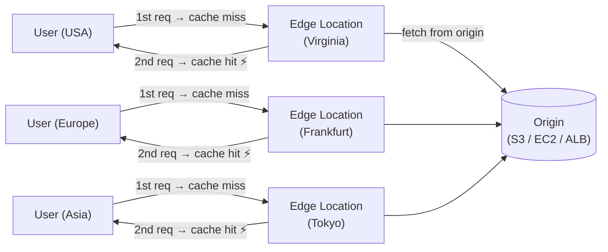
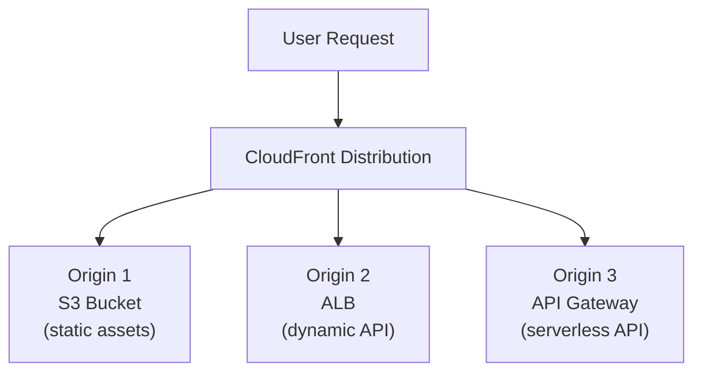
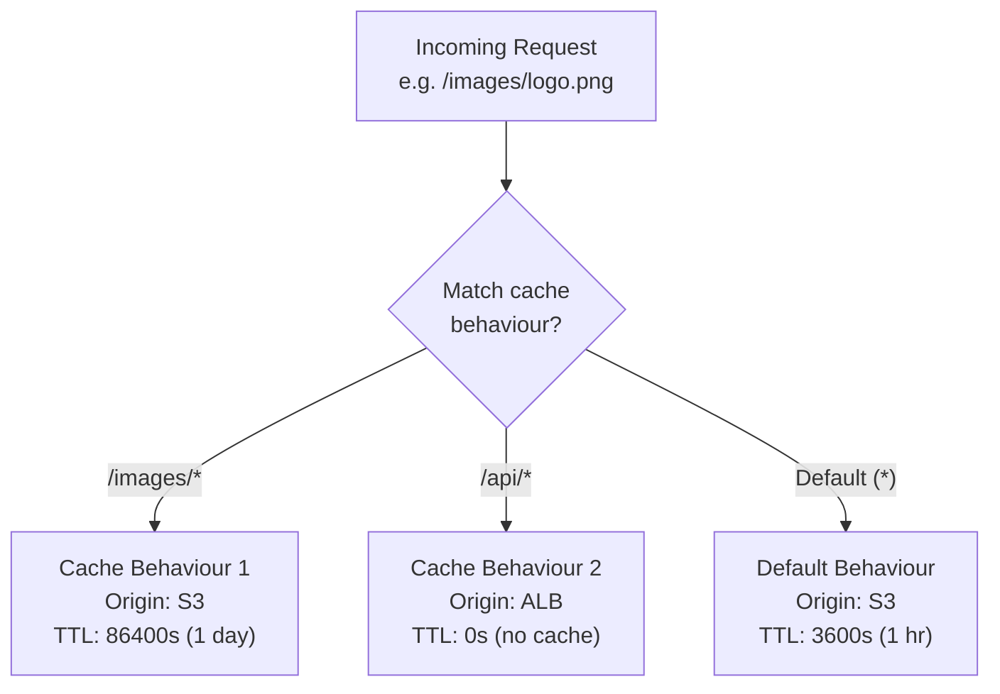
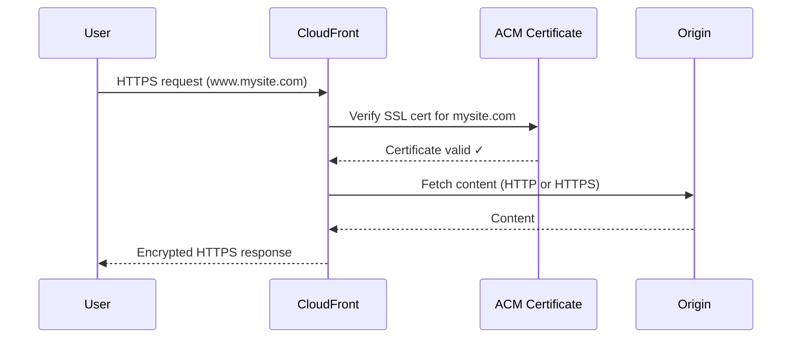
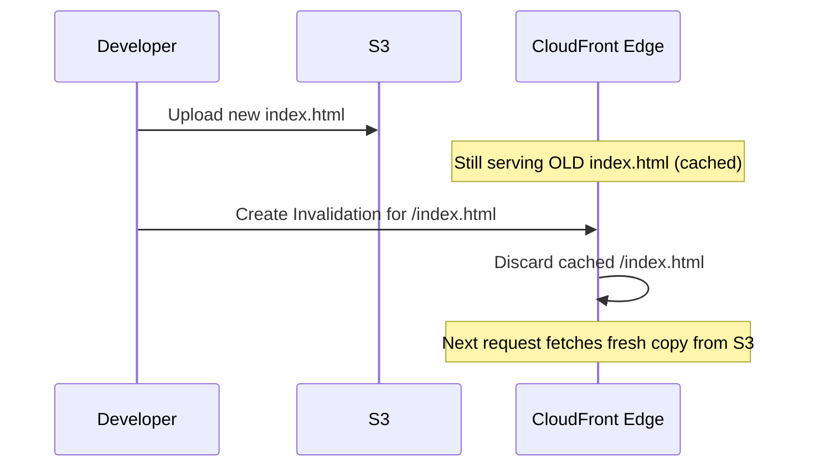
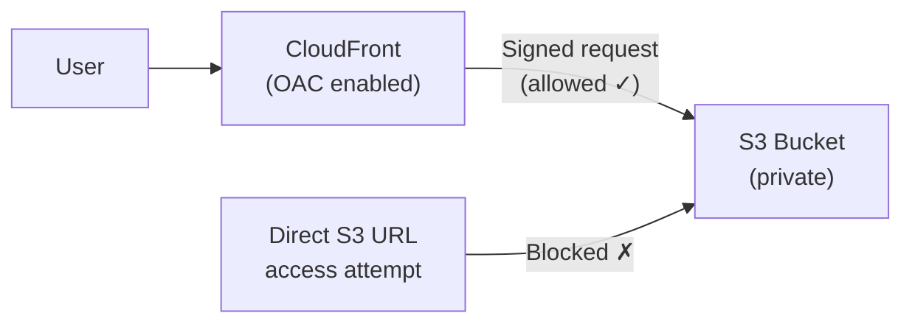
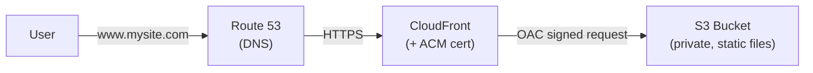
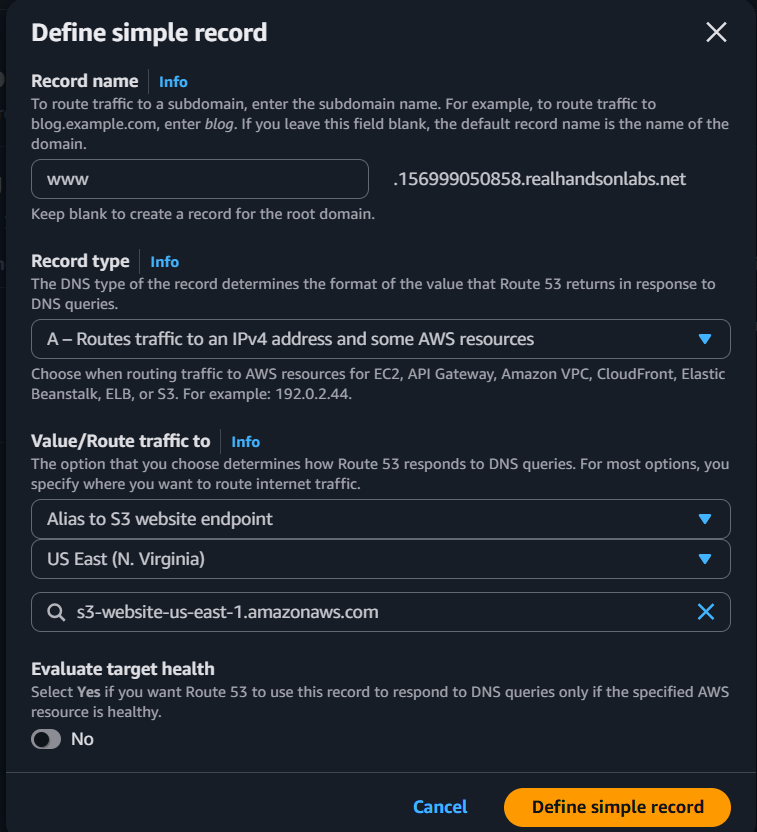

# AWS CloudFront

## What is CloudFront?

CloudFront is AWS's **Content Delivery Network (CDN)** — it caches your content on servers spread across the globe so users get it from a nearby location instead of your origin server.

**Without CDN:** Every request travels all the way to your origin (e.g., S3 in us-east-1), even if the user is in Tokyo.

**With CDN:** The content is cached at an **Edge Location** near the user. First request fetches from origin, subsequent requests are served from cache — much faster.



> AWS has **400+ Edge Locations** worldwide. CloudFront automatically routes users to the nearest one.

---

## Distributions & Origins

A **Distribution** is your CloudFront configuration — it defines where content comes from and how it's served.

An **Origin** is the source CloudFront fetches content from when there's a cache miss.

| Origin Type | Use Case |
|---|---|
| **S3 Bucket** | Static websites, files, images |
| **EC2 Instance** | Custom app servers |
| **Application Load Balancer (ALB)** | Scalable backend APIs/apps behind a load balancer |
| **API Gateway** | REST / HTTP APIs |
| **Custom HTTP endpoint** | Any public web server |



**You can have multiple origins in one distribution** — e.g., serve `/api/*` from an ALB and everything else from S3.

---

## Cache Behaviours & TTL

A **Cache Behaviour** is a rule that tells CloudFront how to handle requests matching a specific URL path pattern.



### TTL (Time To Live)

TTL controls **how long CloudFront keeps the cached content** before fetching fresh content from the origin.

| Setting | Value | Meaning |
|---|---|---|
| **Default TTL** | 86400s (1 day) | Used if origin doesn't specify |
| **Min TTL** | 0 | Cache can be as short-lived as this |
| **Max TTL** | 31536000s (1 year) | Cache won't exceed this |

**Setting TTL via origin response headers:**
- `Cache-Control: max-age=3600` → cache for 1 hour
- `Cache-Control: no-cache` → always revalidate
- `Expires: <date>` → cache until this date

> **Tip:** Static assets (images, CSS, JS with hashed filenames) → long TTL. Dynamic content or APIs → short TTL or 0.

---

## HTTPS with ACM Certificates

CloudFront supports HTTPS out of the box. To use your own domain with HTTPS, attach an **SSL/TLS certificate** from AWS Certificate Manager (ACM).



### Steps to add HTTPS:

1. **Request a certificate in ACM**
   - Go to **ACM → Request certificate → Public certificate**
   - Enter your domain (e.g., `www.mysite.com`)
   - Validate via DNS (ACM creates a CNAME record in Route 53 automatically)

2. **Attach to CloudFront Distribution**
   - In your distribution settings → **Custom SSL certificate** → select the ACM cert
   - Set **Viewer Protocol Policy** to `Redirect HTTP to HTTPS`

> **Important:** ACM certificates for CloudFront **must be in `us-east-1`** (N. Virginia), regardless of where your origin is.

---

## Invalidations — Clearing Cached Content

When you update a file on your origin, CloudFront may still serve the **old cached version** until TTL expires. An **Invalidation** forces CloudFront to discard cached content immediately.



### Creating an Invalidation:

- Go to **CloudFront → Distribution → Invalidations tab → Create**
- Specify paths:
  - `/index.html` — invalidate one file
  - `/images/*` — invalidate all files in a folder
  - `/*` — invalidate everything (use sparingly)

> **Cost note:** First 1,000 invalidation paths/month are free. After that, $0.005 per path.

**Better practice:** Use **versioned/hashed filenames** (e.g., `main.abc123.js`) so you never need to invalidate — each deploy creates a new filename that CloudFront caches fresh automatically.

---

## Restricting S3 Access to CloudFront Only (OAC)

By default, if your S3 bucket is public, users can bypass CloudFront and access files directly via the S3 URL — skipping your CDN, cache, and security policies.

**Origin Access Control (OAC)** locks the S3 bucket so **only CloudFront can read it**.



### How to set up OAC:

**1. In CloudFront:**
- Edit your distribution's Origin settings
- Under **Origin access** → select **Origin access control settings (recommended)**
- Create a new OAC and attach it

**2. Update the S3 Bucket Policy:**
CloudFront will generate the policy for you. It looks like this:
```json
{
  "Version": "2012-10-17",
  "Statement": [
    {
      "Sid": "AllowCloudFrontOnly",
      "Effect": "Allow",
      "Principal": {
        "Service": "cloudfront.amazonaws.com"
      },
      "Action": "s3:GetObject",
      "Resource": "arn:aws:s3:::your-bucket-name/*",
      "Condition": {
        "StringEquals": {
          "AWS:SourceArn": "arn:aws:cloudfront::ACCOUNT_ID:distribution/DISTRIBUTION_ID"
        }
      }
    }
  ]
}
```

**3. Make the S3 bucket private:**
- Turn on **Block all public access** in the S3 bucket settings
- Remove any existing public bucket policies

> OAC replaces the older **OAI (Origin Access Identity)** method. Always use OAC for new setups.

---

## Practical Example: Hosting a React App on CloudFront + S3

This walkthrough shows all the above concepts applied end-to-end.



### Step 1: Create S3 Buckets

> **Note:** In a Pluralsight sandbox — get your domain from **Route 53 → Hosted Zones** (a sample URL is pre-created).

- Create **2 buckets**:
  - `www.mysite.com` — holds all the React build files
  - `mysite.com` — only used to redirect to the `www.` bucket

### Step 2: Upload React Build Files

- Upload into the `www.mysite.com` bucket
- Use **Add files** for individual files, **Add folder** for directories

### Step 3: Enable Static Website Hosting (www. bucket)

- **Properties tab** → scroll to **Static website hosting** → Edit
  - Enable it, set type to **Host a static website**
  - Set **Index document** to `index.html`
  - Save

### Step 4: Set Up Redirect (non-www bucket)

- In `mysite.com` bucket → **Properties → Static website hosting → Edit**
  - Choose **Redirect requests for an object**
  - Hostname: `www.mysite.com`
  - Protocol: `HTTP`

### Step 5: Request an SSL Certificate (ACM)

- Go to **ACM → Request certificate → Public** (make sure you're in **us-east-1**)
- Enter `www.mysite.com` as the domain
- Choose **DNS validation** → click Request
- Click on the pending certificate → **Create records in Route 53** (auto-validates)

### Step 6: Create a CloudFront Distribution

- **CloudFront → Create distribution**
- **Origin domain:** select your `www.mysite.com` S3 bucket
- **Origin access:** select **Origin access control** → create new OAC
- **Viewer protocol policy:** Redirect HTTP to HTTPS
- **Custom SSL certificate:** select the ACM cert from Step 5
- Leave other settings as default → **Create distribution**
- Copy the CloudFront bucket policy it generates → paste it into your S3 bucket policy
- Make sure **Block all public access** is ON for the S3 bucket

### Step 7: Point Route 53 to CloudFront

- **Route 53 → Hosted Zones → your zone → Create record**
- Use **Simple routing → Define simple record**
- Record name: `www`
- Record type: **A**
- Value/route traffic to: **Alias to CloudFront distribution** → select your distribution

> Use an **Alias A record** (not CNAME) — it's free, works on the zone apex, and supports health checks. See [6_Route53.MD](./6_Route53.MD) for full details on record types and routing policies.

<details>
<summary>Reference screenshot</summary>



</details>

### Step 8: Update Files (Using Invalidations)

When you redeploy your React app:
1. Upload new build files to S3 (overwrite existing)
2. Go to **CloudFront → Distribution → Invalidations → Create invalidation**
3. Enter `/*` to clear all cached files
4. CloudFront will fetch fresh files on the next request

---

## Key Concepts Summary

| Concept | What it does |
|---|---|
| **Distribution** | Your CloudFront config (origins, behaviours, certs) |
| **Origin** | Where CloudFront fetches content from (S3, EC2, ALB, etc.) |
| **Edge Location** | Global cache server close to users |
| **Cache Behaviour** | Rules per URL path — which origin, what TTL |
| **TTL** | How long content stays cached before refreshing |
| **ACM Certificate** | SSL cert for HTTPS on your custom domain |
| **Invalidation** | Force-clear cached content before TTL expires |
| **OAC** | Locks S3 so only CloudFront can access it |

---

###### Resources:
- Hosting a React app with CF — https://www.youtube.com/watch?v=mls8tiiI3uc
