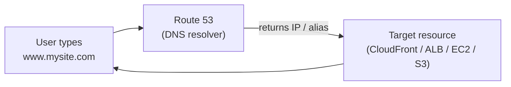
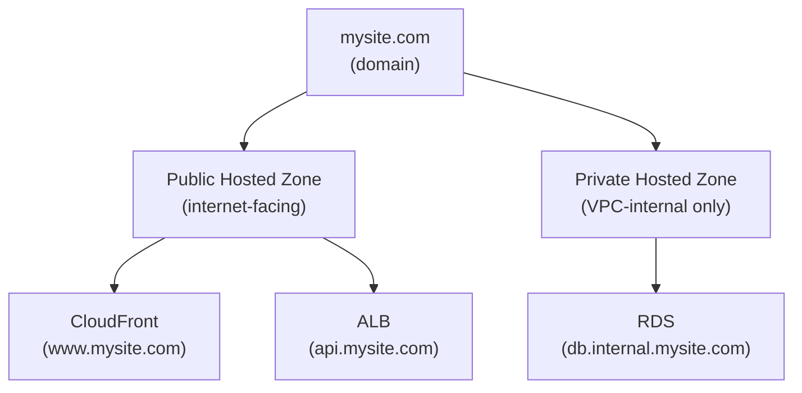
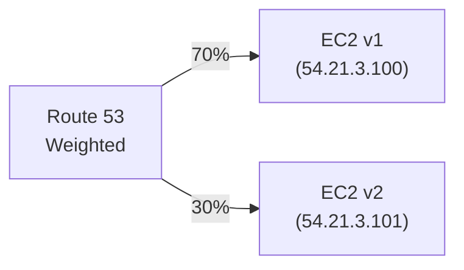
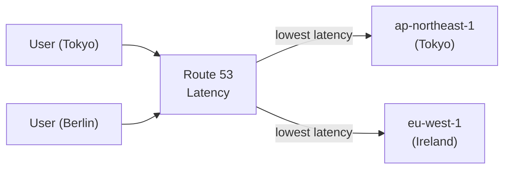
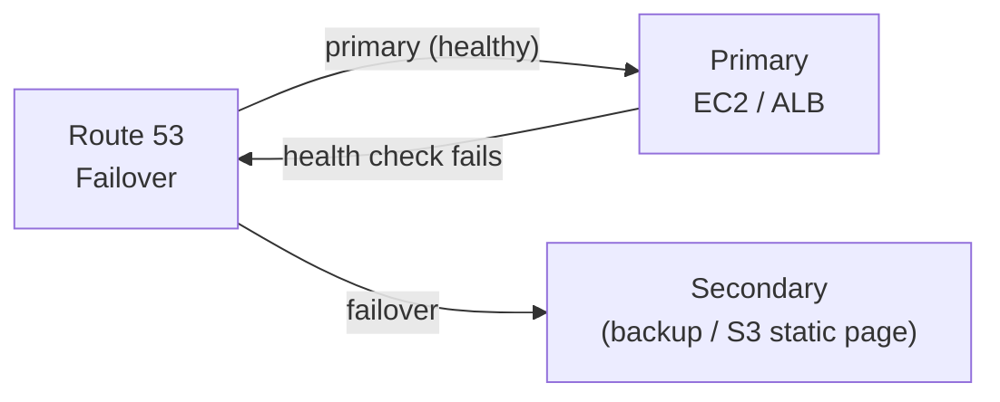
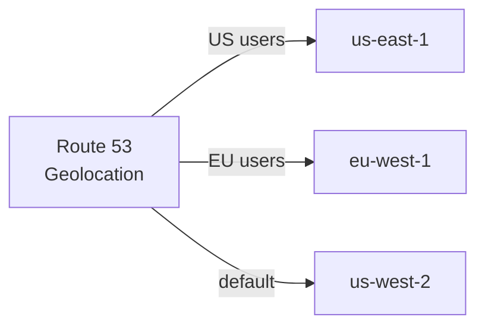
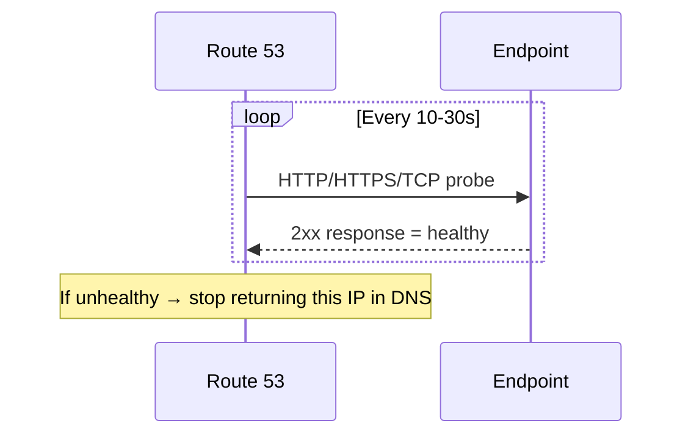
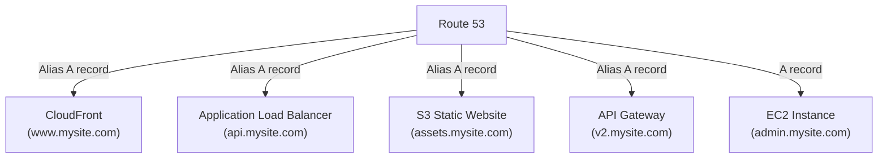
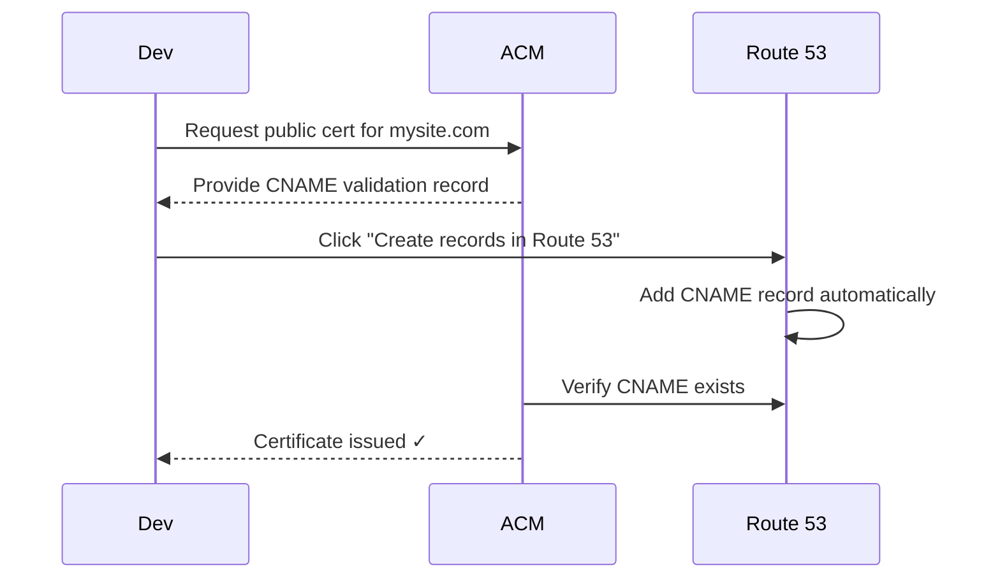
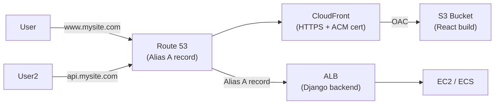

# AWS Route 53

## What is Route 53?

Route 53 is AWS's **DNS (Domain Name System)** service — it translates human-readable domain names into IP addresses so browsers can find the right server.

**It does three things:**
1. **Domain registration** — buy/manage domains directly in AWS
2. **DNS routing** — route traffic to AWS resources or external endpoints
3. **Health checking** — monitor endpoints and reroute on failure



> The name "Route 53" refers to TCP/UDP **port 53** — the standard DNS port.

---

## Hosted Zones

A **Hosted Zone** is a container for DNS records for a specific domain. Route 53 automatically creates one when you register a domain.

| Type | Used For |
|---|---|
| **Public Hosted Zone** | Routes traffic on the public internet (e.g., `www.mysite.com`) |
| **Private Hosted Zone** | Routes traffic within a VPC only (e.g., internal microservices) |



Each hosted zone automatically gets **NS** (Name Server) and **SOA** (Start of Authority) records on creation.

---

## Record Types

| Record | Purpose | Example |
|---|---|---|
| **A** | Maps domain → IPv4 address | `mysite.com → 54.21.3.100` |
| **AAAA** | Maps domain → IPv6 address | `mysite.com → 2001:db8::1` |
| **CNAME** | Maps domain → another domain name | `www.mysite.com → mysite.com` |
| **Alias** | AWS-specific — maps to AWS resources | `www.mysite.com → d1234.cloudfront.net` |
| **MX** | Mail server routing | `mysite.com → mail.mysite.com` |
| **TXT** | Text data (SPF, domain verification) | `"v=spf1 include:..."` |
| **NS** | Name servers for the zone | Auto-created by Route 53 |
| **SOA** | Zone metadata (TTL, admin email) | Auto-created by Route 53 |

### Alias vs CNAME — Key Difference

| | **CNAME** | **Alias** |
|---|---|---|
| Points to | Any hostname | AWS resource (CloudFront, ALB, S3, etc.) |
| On zone apex? | ❌ No (`mysite.com` not allowed) | ✅ Yes |
| DNS query charge | Yes | **Free** |
| Health checks | No | Yes (for some targets) |

> **Rule of thumb:** Use **Alias** for AWS resources, **CNAME** for non-AWS external hostnames.

---

## Routing Policies

Routing policies control **how Route 53 responds** to DNS queries.

### Simple Routing
One record, one target. No health checks.

```
www.mysite.com → 54.21.3.100
```

Use for: basic single-resource setups.

---

### Weighted Routing
Split traffic by percentage across multiple targets.



Use for: **A/B testing**, **blue-green deployments**, gradually shifting traffic.

---

### Latency-Based Routing
Routes to the region with the **lowest latency** for the user.



Use for: globally distributed apps where response time matters.

---

### Failover Routing
Active/passive setup. If the primary fails a health check, traffic shifts to secondary.



Use for: **disaster recovery**, high availability.

---

### Geolocation Routing
Routes based on the **geographic location** of the user (country/continent).



Use for: compliance (data residency laws), localized content.

> Different from latency-based — it's about **where the user is**, not speed.

---

### Geoproximity Routing (Traffic Flow only)
Like geolocation but you can **bias** the routing radius — expand or shrink a region's reach.

Use for: shifting traffic toward a specific region even if users are slightly outside it.

---

### Multi-Value Answer Routing
Returns up to **8 healthy IP addresses** per query. Client picks one. Acts like a basic load balancer.

Use for: simple client-side load balancing with health checks (not a replacement for ALB).

---

## Health Checks

Route 53 health checks monitor endpoints and mark them healthy/unhealthy.



| Health Check Type | What it monitors |
|---|---|
| **Endpoint** | Public IP or URL (HTTP/HTTPS/TCP) |
| **Calculated** | Combines multiple health checks (AND/OR logic) |
| **CloudWatch alarm** | Ties health to a CloudWatch metric |

> Health checks only work on **public endpoints**. For private resources, use a CloudWatch alarm health check.

---

## Integration with AWS Services



All AWS resource targets should use **Alias records** — they're free, support the zone apex, and integrate with health checks.

---

## ACM DNS Validation via Route 53

When requesting a TLS certificate from ACM, DNS validation requires adding a CNAME record to prove domain ownership. Route 53 can do this **automatically**.



> ACM re-checks this CNAME before cert renewal — **don't delete it** after validation.

---

## Practical: Full DNS Setup for a Web App



| Record | Type | Target |
|---|---|---|
| `www.mysite.com` | Alias A | CloudFront distribution |
| `mysite.com` | Alias A | CloudFront distribution (zone apex) |
| `api.mysite.com` | Alias A | Application Load Balancer |
| `_acme.mysite.com` | CNAME | ACM validation record |

---

## Key Concepts Summary

| Concept | What it does |
|---|---|
| **Hosted Zone** | Container for all DNS records for a domain |
| **A / AAAA record** | Maps domain to IPv4 / IPv6 |
| **CNAME** | Maps domain to another hostname (not on zone apex) |
| **Alias record** | AWS-specific — maps to AWS resources, free, supports apex |
| **Routing Policy** | How Route 53 picks which record to return |
| **Health Check** | Monitors endpoints; removes unhealthy targets from DNS |
| **TTL** | How long resolvers cache the DNS answer |

---

###### Resources:
- Route 53 Routing Policies — https://docs.aws.amazon.com/Route53/latest/DeveloperGuide/routing-policy.html
- See also: [5_Cloudfront.MD](./5_Cloudfront.MD) — wiring Route 53 to a CloudFront + S3 deployment
