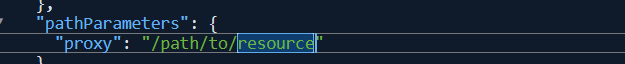

# AWS Lambda

- A serverless compute service, only billed when it is run (pay per use/execution model)
- **serverless**: There is still a server but I do not manage the server resources (os, ram, memory, etc...), I simply write a function (lambda function) that will get triggerd whenever an event occurs (such as http req, file upload, schedule) -> AWS spins up a server -> does the job -> kills it.
- pros:
    - PAY AS YOU USE
    - Auto scaling (load-balancing)
    - Easy to integrate with other sevices
    - less management
- cons:
    - No control over low level infrastructure details (meaning I cannot control the no. of nodes when scaling up/down, etc...)
    - Non persistent data: meaning that the data stored in Lambda will be erased once the server dies (such as .txt, .json, etc..) - whichever file we use as DB.

- Difference between EC2 (server) and Lambda(serverless) archi.

| Feature            | EC2                     | Serverless (Lambda)            |
|--------------------|--------------------------|---------------------------------|
| Server management  | You manage it           | AWS manages it                |
| Scaling            | Manual or complex setup | Automatic, instant            |
| Cost when idle     | Still paying 💸          | $0 💚                          |
| Startup time       | Minutes to launch       | Milliseconds                  |
| Max run time       | Unlimited               | 15 minutes per function       |
| OS control         | Full control            | No control (AWS handles)      |
| Best for           | Long-running apps       | Short tasks, APIs, events     |
| Learning curve     | Steeper                 | Much easier to start          |

---

## Concepts:

**Execution Model:**

- This is what happens when a lambda fucntion runs the code
```bash
Event Source → Lambda Service → Execution Environment → Your Handler → Response
```

- Event Source: the entry point from where the req/trigger enters lambda (eg. APIGateway)
- Lambda Service: AWS's Orchestration layer -> Decides what to do with the json (received from event source) -> either to cold start an env or pass it to a warm env
- Execution Environment: Isolated container (server) where the code actually lives/runs
    - Inside this Env. the handler gets the JSON -> passes it to Fastapi app. then gets the response from it -> send it to Lambda -> api gateway -> user


**Cold Starts and how to minimize them**
- A cold start happens when Lambda has to spin up a brand new execution environment because no warm one is available.
- Lifecycle of an execution environment:
```
Cold Start:  [Init Phase] → [Download code] → [Start runtime] → [Run handler]
Warm Start:                                                    → [Run handler]
```
- How to Minimize Cold Starts
    | Strategy | How |
    |---------|-----|
    | Provisioned Concurrency | Pre-warms N environments — they're always ready, no init phase |
    | Keep functions warm | Scheduled pings (EventBridge rule every 5 min) — hacky but works |
    | Reduce package size | Smaller zip = faster download. Tree-shake, don't bundle unused libs |
    | Choose a faster runtime | Go/Rust < Node.js/Python << Java/C# (JVM/CLR are the worst for cold starts) |
    | Avoid heavy init outside handler | DB connections, SDK clients initialized at module level persist across warm invocations — but delay the cold start |


---
## Example: Hosting Fastapi app with Lambda:

### Step 1:
- Create a lambda fucntion from AWS Console
- From scratch -> give a name and runtime (based on project)
- Leave others mostly to be defaults

## Step 2:
- **AWS Lambda uses a handler function to connect with the backend resources and this is called lambda handler -> in python we use Mangum pkg to create a handler for Fastapi, this handler will route to correct endpoints in the backend appliction**
- Create a handler for fastapi app [refer](Week%20N/AWS/05_Lambda/Fastapi_book_api_lambda/main.py) - line 27

### Step 3:
- Move/install the files into a dir to zip it
```bash
# This will install all reqs from req.txt into lib dir
pip install -t lib -r requirements.txt
```

- ZIP the code files + with dependencies using the following cmd
- **Use Linux since AWS server is also linux**
```bash
# go to lib dir (where all dependency is at)
# create a zip file named lambda_function.zip outside that dir and zip all contents inside it recursively
cd lib; zip ../lambda_function.zip -r .
```

- Add the main.py and books.json to that zip

```bash
zip lambda_function.zip -u main.py
zip lambda_function.zip -u books.json
```

### Step 4
- In AWS console/under newly created lambda's code section
- Click upload from > choose .zip file > upload the zipped file (lambda_fucntion.zip)
- Scroll under the code section > Under runtime settings edit the handler info to point to correct handler in main.py (since the hander variable is in main.py - the handler would be main.handler)
- Also in runtime settings make sure that it uses appropriate python version (latest for ubuntu)

### Step 5:
- Test the lambda with proper fastapi payload
- Under test tab > create new test event > give a new name (fastapi_payload)
- Under template choose 'API Gateway AWS Proxy'
- Inside Event JSON use the correct http method and path (there will be multiple places to modify in that json - about 3)

    <details>
    <summary>change this path to the api endpoints</summary>

    

    </details>
- Then try to test again, it should/will work

**ALTERNATIVELY - new feat**
- Go to Configuration tab
- select funtional URL from side bar
- Then create funtional url
    - Auth type: None
    - rest of the settings - Default
    - Finally save
- Then use the created functional url to view the api response - modify the final part (with /path/to/valid/resource to navigate - like how you would do in a local host)
- If in future you need to modify the url use R53


---
##### Resources:
- Simple AWS Lambda(YT) - https://www.youtube.com/watch?v=S0rlj67cTHw
-
