# Docker Architecture Documentation

## FastAPI Inventory Manager Project

This document explains in detail how Docker works within this project, including the complete flow of secrets, environment variables, networking, and the build/runtime process.

---

## Table of Contents

1. [Project Structure Overview](#project-structure-overview)
2. [Docker Components Explained](#docker-components-explained)
3. [Complete Docker Flow](#complete-docker-flow)
4. [Secrets Management](#secrets-management)
5. [Environment Variables Flow](#environment-variables-flow)
6. [Networking Architecture](#networking-architecture)
7. [Build Process](#build-process)
8. [Runtime Process](#runtime-process)
9. [Data Persistence](#data-persistence)
10. [Troubleshooting Guide](#troubleshooting-guide)

---

## Project Structure Overview

```
project-root/
├── docker-compose.yml          # Orchestrates all services
├── secrets/                    # Docker secrets (gitignored)
│   └── db_password.txt        # PostgreSQL password
├── project/                    # Application directory
│   ├── Dockerfile             # Container build instructions
│   ├── .env                   # Environment variables (gitignored)
│   ├── .env.example           # Template for .env
│   ├── .dockerignore          # Files to exclude from build
│   ├── requirements.txt       # Python dependencies
│   ├── package/               # Local packages
│   └── src/                   # Application source code
│       ├── api/
│       │   └── main.py       # FastAPI application
│       ├── core/
│       │   ├── settings.py   # Pydantic settings
│       │   └── ...
│       └── ...
└── data/                      # Persistent data (optional)
```

---

## Docker Components Explained

### 1. **Dockerfile** - The Blueprint

The Dockerfile defines how to build your application container image.

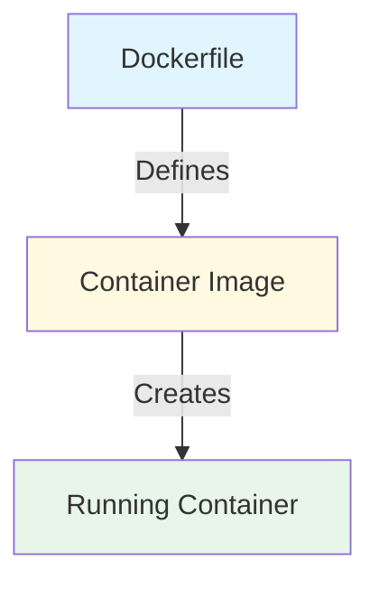

**Your Dockerfile Breakdown:**

```dockerfile
# Base image - minimal Python 3.12 installation
FROM python:3.12-slim

# Set working directory inside container
WORKDIR /app

# Copy dependency list first (for Docker layer caching)
COPY requirements.txt .
COPY package ./package

# Install Python dependencies
RUN pip3 install --no-cache-dir -r requirements.txt

# Copy application source code
COPY /src ./src/

# Expose port (documentation only, doesn't publish)
EXPOSE 5003

# Command to run when container starts
CMD [ "python", "-m", "src.api.main" ]
```

**Why this order matters:**

- Files that change less frequently (requirements.txt) are copied first
- Docker caches each layer - if requirements don't change, that layer is reused
- Source code changes frequently, so it's copied last

---

### 2. **docker-compose.yml** - The Orchestrator

Docker Compose manages multiple containers and their relationships.

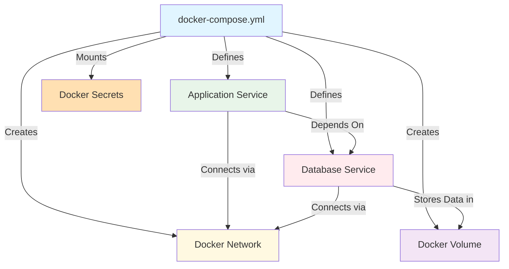

---

### 3. **.dockerignore** - The Filter

Prevents unnecessary or sensitive files from being copied into the image.

```
.env
.env.*
!.env.example
__pycache__
*.pyc
.git
.venv/
node_modules/
*.log
```

**Why this is critical:**

- `.env` files contain secrets - must NEVER be in the image
- Reduces image size by excluding unnecessary files
- Speeds up build process

---

## Complete Docker Flow

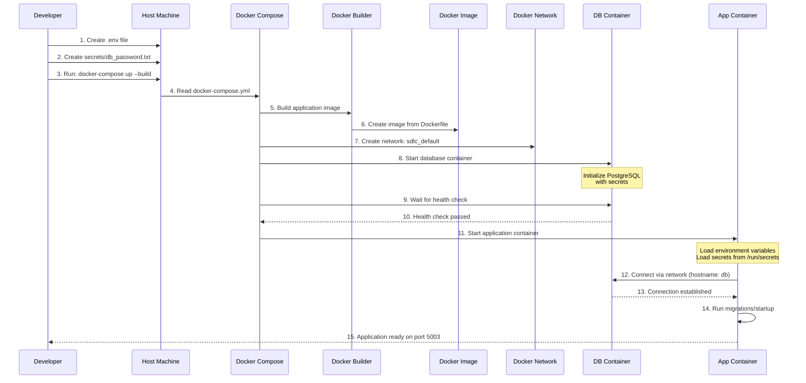

---

## Secrets Management

### How Docker Secrets Work

```mermaid
graph TB
    subgraph "Host Machine"
        SF[secrets/db_password.txt<br/>Plain text file]
    end

    subgraph "Docker Compose"
        DS[Docker Secrets<br/>Configuration]
    end

    subgraph "Database Container"
        DBSEC[/run/secrets/db_password<br/>Read-only mount]
        DBENV[POSTGRES_PASSWORD_FILE<br/>Environment Variable]
        DBINIT[PostgreSQL Init<br/>Reads from file]

        DBENV -->|Points to| DBSEC
        DBINIT -->|Reads| DBSEC
    end

    subgraph "App Container"
        APPSEC[/run/secrets/db_password<br/>Read-only mount]
        PYDANTIC[Pydantic Settings<br/>secrets_dir=/run/secrets]
        APPCODE[Application Code]

        PYDANTIC -->|Reads| APPSEC
        APPCODE -->|Uses| PYDANTIC
    end

    SF -->|Mounted as| DS
    DS -->|Mounts into| DBSEC
    DS -->|Mounts into| APPSEC

    style SF fill:#ffe0b2
    style DS fill:#fff9e1
    style DBSEC fill:#ffcdd2
    style APPSEC fill:#c8e6c9
    style PYDANTIC fill:#b2dfdb
```

### Secret Configuration in docker-compose.yml

```yaml
secrets:
  db_password:
    file: ./secrets/db_password.txt # Path on host
```

### How Containers Access Secrets

**Database Container:**

```yaml
services:
  db:
    secrets:
      - db_password
    environment:
      POSTGRES_PASSWORD_FILE: /run/secrets/db_password
```

PostgreSQL reads the password from the file path specified in `POSTGRES_PASSWORD_FILE`.

**Application Container:**

```yaml
services:
  project:
    secrets:
      - db_password
```

Pydantic Settings automatically reads from `/run/secrets/` directory:

```python
model_config = SettingsConfigDict(
    secrets_dir="/run/secrets",  # Pydantic looks here
)
```

---

## Environment Variables Flow

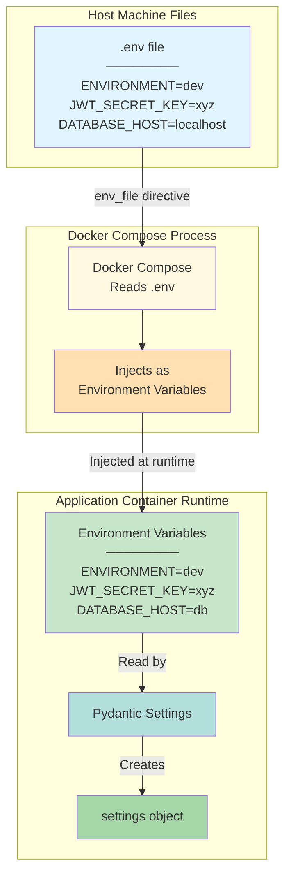

### Key Understanding

**The .env file is NEVER copied into the container!**

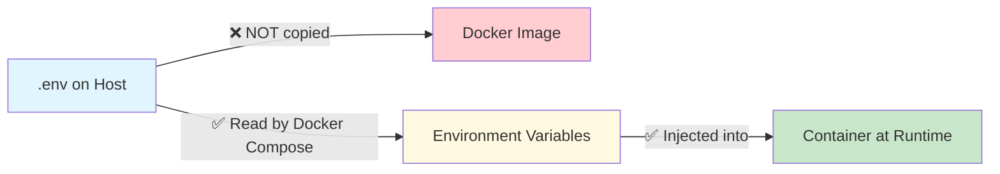

### Environment Variable Priority

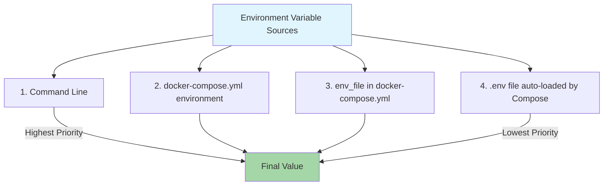

Example:

```bash
# This overrides everything else
docker-compose run -e DATABASE_HOST=custom-db project
```

---

## Networking Architecture

```mermaid
graph TB
    subgraph "Host Machine"
        HOST[localhost:5003]
        BROWSER[Web Browser]
    end

    subgraph "Docker Network: sdlc_default"
        subgraph "App Container"
            APP[FastAPI App<br/>Port 5003<br/>Hostname: project]
        end

        subgraph "DB Container"
            DB[PostgreSQL<br/>Port 5432<br/>Hostname: db]
        end
    end

    BROWSER -->|http://localhost:5003| HOST
    HOST -->|Port Mapping 5003:5003| APP
    APP -->|postgresql://postgres@db:5432| DB

    style HOST fill:#e1f5ff
    style APP fill:#c8e6c9
    style DB fill:#ffcdd2
    style BROWSER fill:#fff9e1
```

### How Service Discovery Works

**Inside Docker Network:**

- Each service gets a hostname matching its service name
- `db` service → hostname `db`
- `project` service → hostname `project`
- Docker's internal DNS resolves these names

**Database Connection String:**

```python
# ❌ Wrong - localhost refers to the container itself
DATABASE_URL = "postgresql://postgres@localhost:5432/db"

# ✅ Correct - 'db' is the service name
DATABASE_URL = "postgresql://postgres@db:5432/db"
```

### Port Mapping Explained

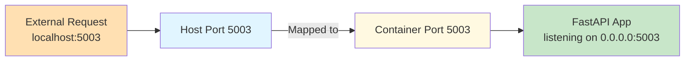

**docker-compose.yml:**

```yaml
ports:
  - "5003:5003"
  #  ^^^^  ^^^^
  #  Host  Container
```

**What this means:**

- Container port `5003` is mapped to host port `5003`
- You can access via `http://localhost:5003`
- Change to `"8080:5003"` to access via `http://localhost:8080`

---

## Build Process

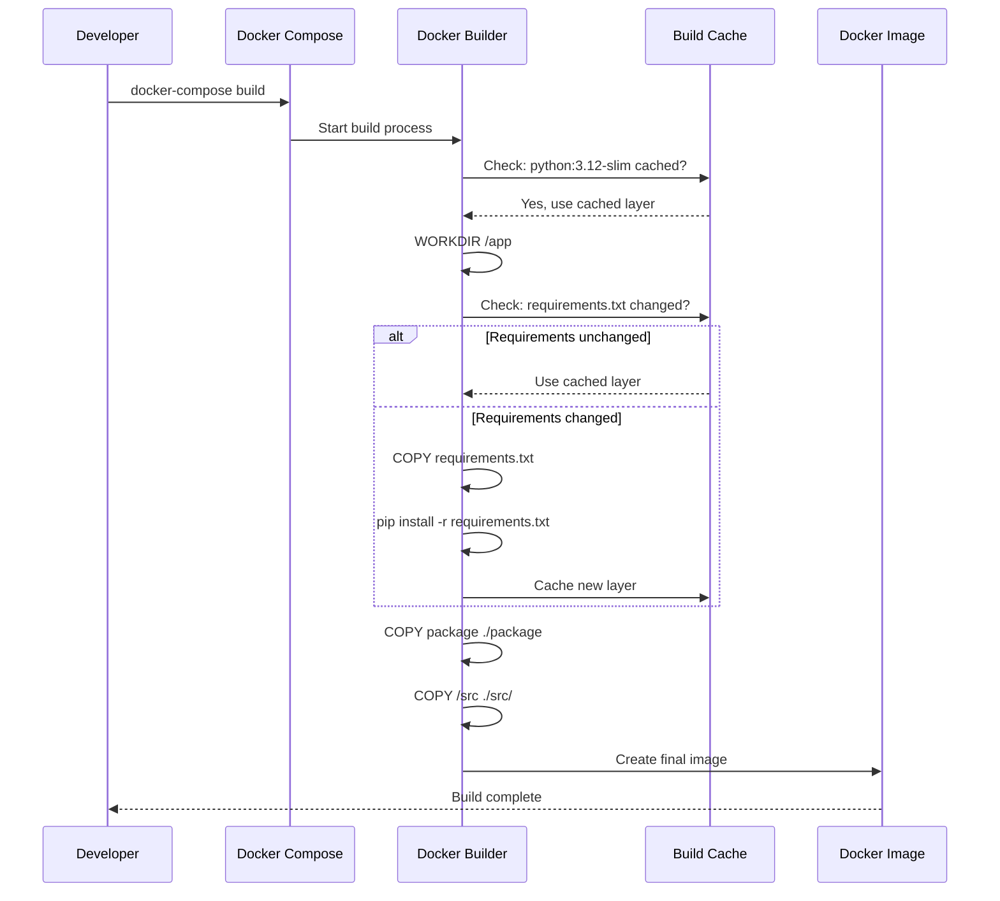

### Layer Caching Strategy

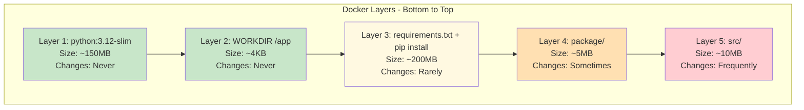

**Optimization Tips:**

- Layers that change less frequently should be earlier
- Each `RUN`, `COPY`, `ADD` creates a new layer
- Cached layers are reused if nothing before them changed

---

## Runtime Process

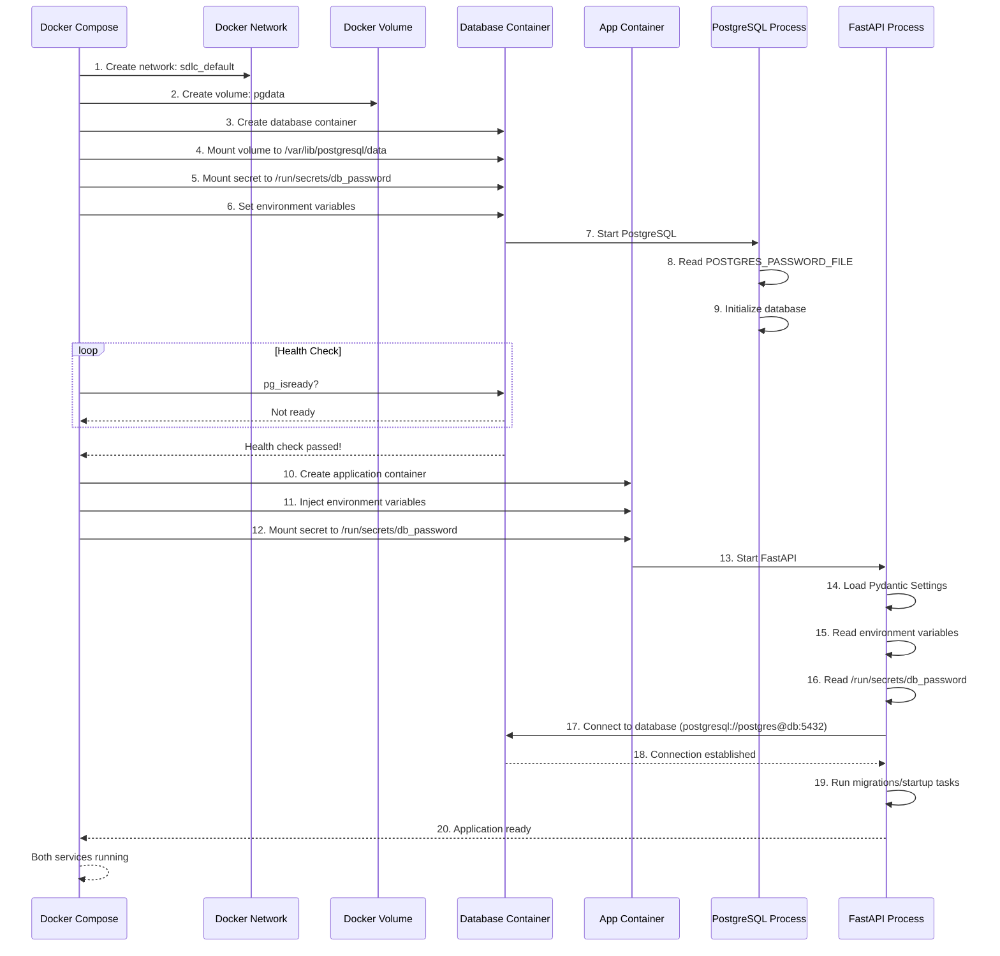

### Container Lifecycle

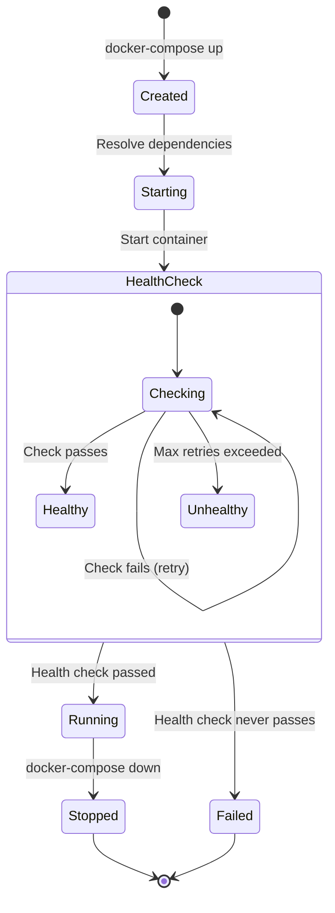

---

## Data Persistence

```mermaid
graph TB
    subgraph "Host Machine"
        DIR[Docker Volume Storage<br/>/var/lib/docker/volumes/]
        NAMEDVOL[sdlc_pgdata/]
    end

    subgraph "Database Container"
        MOUNT[/var/lib/postgresql/data]
        PGDATA[PostgreSQL Data Files]
    end

    DIR --> NAMEDVOL
    NAMEDVOL -->|Mounted to| MOUNT
    MOUNT --> PGDATA

    style DIR fill:#e1f5ff
    style NAMEDVOL fill:#fff9e1
    style MOUNT fill:#ffe0b2
    style PGDATA fill:#ffcdd2
```

### Volume Configuration

```yaml
volumes:
  pgdata: # Named volume
```

### Why Use Volumes?

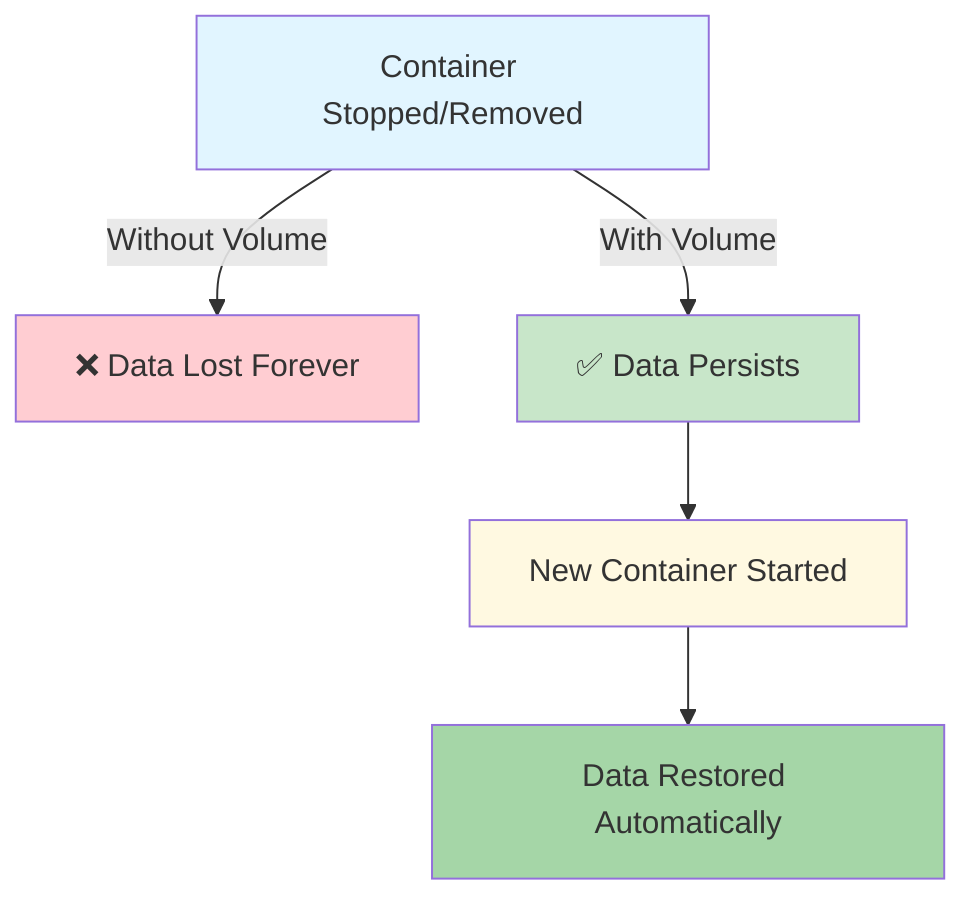

### Volume Commands

```bash
# List volumes
docker volume ls

# Inspect volume
docker volume inspect sdlc_pgdata

# Remove volume (⚠️ deletes all data!)
docker volume rm sdlc_pgdata

# Remove all unused volumes
docker volume prune
```

---

## Complete Configuration Example

### docker-compose.yml (Corrected)

```yaml
version: "3.8"

services:
  # Database Service
  db:
    image: postgres:16
    container_name: sdlc-db

    # Environment variables for PostgreSQL
    environment:
      POSTGRES_DB: inventory_manager
      POSTGRES_USER: postgres
      POSTGRES_PASSWORD_FILE: /run/secrets/db_password

    # Mount the secret
    secrets:
      - db_password

    # Persist data
    volumes:
      - pgdata:/var/lib/postgresql/data

    # Health check - ensures DB is ready before app starts
    healthcheck:
      test: ["CMD-SHELL", "pg_isready -U postgres -d inventory_manager"]
      interval: 5s
      timeout: 5s
      retries: 5

    # Internal network only (no port exposure to host)
    networks:
      - app-network

  # Application Service
  project:
    build: ./project
    container_name: sdlc-app

    # Expose to host
    ports:
      - "5003:5003"

    # Mount secret
    secrets:
      - db_password

    # Load environment variables from .env file
    env_file:
      - ./project/.env

    # Override specific environment variables
    environment:
      - DATABASE_HOST=db # Use service name as hostname

    # Wait for database to be healthy
    depends_on:
      db:
        condition: service_healthy

    # Connect to same network
    networks:
      - app-network

    # Restart policy
    restart: unless-stopped

# Secret definitions
secrets:
  db_password:
    file: ./secrets/db_password.txt

# Volume definitions
volumes:
  pgdata:
    driver: local

# Network definitions
networks:
  app-network:
    driver: bridge
```

### Dockerfile (Optimized)

```dockerfile
# Use official Python slim image
FROM python:3.12-slim

# Set environment variables
ENV PYTHONUNBUFFERED=1 \
    PYTHONDONTWRITEBYTECODE=1 \
    PIP_NO_CACHE_DIR=1 \
    PIP_DISABLE_PIP_VERSION_CHECK=1

# Create non-root user for security
RUN useradd -m -u 1000 appuser

# Set working directory
WORKDIR /app

# Install system dependencies (if needed)
RUN apt-get update && apt-get install -y \
    postgresql-client \
    && rm -rf /var/lib/apt/lists/*

# Copy and install Python dependencies
COPY --chown=appuser:appuser requirements.txt .
COPY --chown=appuser:appuser package ./package
RUN pip3 install --no-cache-dir -r requirements.txt

# Copy application code
COPY --chown=appuser:appuser /src ./src/

# Switch to non-root user
USER appuser

# Expose port
EXPOSE 5003

# Health check
HEALTHCHECK --interval=30s --timeout=10s --start-period=5s --retries=3 \
    CMD python -c "import urllib.request; urllib.request.urlopen('http://localhost:5003/health')" || exit 1

# Run application
CMD ["python", "-m", "src.api.main"]
```

### .dockerignore

```
# Environment files
.env
.env.*
!.env.example

# Python
__pycache__/
*.py[cod]
*$py.class
*.so
.Python
build/
develop-eggs/
dist/
downloads/
eggs/
.eggs/
lib/
lib64/
parts/
sdist/
var/
wheels/
*.egg-info/
.installed.cfg
*.egg

# Virtual environments
venv/
ENV/
env/
.venv

# IDEs
.vscode/
.idea/
*.swp
*.swo
*~

# OS
.DS_Store
Thumbs.db

# Git
.git/
.gitignore

# Testing
.pytest_cache/
.coverage
htmlcov/

# Documentation
*.md
!README.md

# Logs
*.log

# Data
data/
*.db
*.sqlite
```

### Pydantic Settings (src/core/settings.py)

```python
from pathlib import Path
from typing import Optional
from pydantic import AliasChoices, Field
from pydantic_settings import BaseSettings, SettingsConfigDict
from src.core.singleton_pattern import Singleton

class Settings(BaseSettings, metaclass=Singleton):
    """Application configuration settings."""

    # PostgreSQL Configuration
    postgresql_pwd: str = Field(
        validation_alias=AliasChoices("POSTGRESQL_PWD", "db_password")
    )

    database_host: str = Field(
        default="localhost",
        validation_alias=AliasChoices("DATABASE_HOST", "DB_HOST")
    )

    database_name: str = Field(
        default="inventory_manager",
        validation_alias=AliasChoices("DATABASE_NAME", "POSTGRES_DB")
    )

    database_user: str = Field(
        default="postgres",
        validation_alias=AliasChoices("DATABASE_USER", "POSTGRES_USER")
    )

    database_port: int = Field(
        default=5432,
        validation_alias=AliasChoices("DATABASE_PORT", "DB_PORT")
    )

    @property
    def DATABASE_URL(self) -> str:
        """Generate PostgreSQL database URL."""
        return (
            f"postgresql+asyncpg://{self.database_user}:{self.postgresql_pwd}"
            f"@{self.database_host}:{self.database_port}/{self.database_name}"
        )

    # Environment
    environment: str = Field(
        default="development",
        validation_alias="ENVIRONMENT"
    )

    # JWT
    JWT_SECRET_KEY: str = Field(validation_alias="JWT_SECRET_KEY")
    ALGORITHM: str = "HS256"
    ACCESS_TOKEN_EXPIRE_MINUTES: int = 30

    # File paths
    INVENTORY_CSV_FILEPATH: str = str(
        Path(__file__).parent.parent.parent / "data" / "new_inventory.csv"
    )

    # Pydantic configuration
    model_config = SettingsConfigDict(
        # Secrets directory for Docker secrets
        secrets_dir="/run/secrets",

        # For local development (optional, will be overridden by Docker)
        env_file=str(Path(__file__).parent.parent.parent / ".env"),
        env_file_encoding="utf-8",

        # Settings
        case_sensitive=False,
        extra="ignore",
    )

settings = Settings()
```

### .env.example

```bash
# Environment
ENVIRONMENT=development

# Database Configuration
# Note: DATABASE_HOST is overridden to 'db' by docker-compose
DATABASE_HOST=localhost
DATABASE_NAME=inventory_manager
DATABASE_USER=postgres
DATABASE_PORT=5432

# JWT Configuration
JWT_SECRET_KEY=your-super-secret-jwt-key-change-in-production

# Note: POSTGRESQL_PWD comes from Docker secrets (/run/secrets/db_password)
# For local development without Docker, set it here:
# POSTGRESQL_PWD=your_local_dev_password
```

---

## Troubleshooting Guide

### Common Issues and Solutions

#### 1. Database Connection Refused

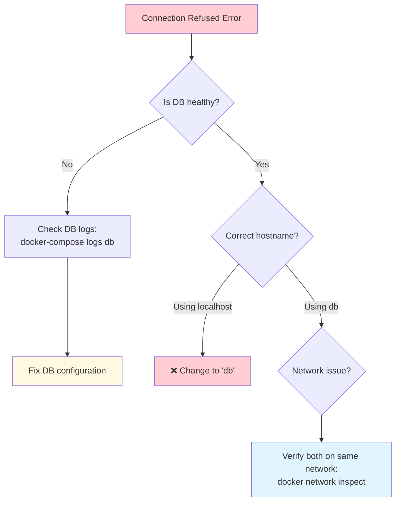

**Solution:**

```python
# ❌ Wrong
DATABASE_URL = "postgresql://postgres@localhost:5432/db"

# ✅ Correct
DATABASE_URL = "postgresql://postgres@db:5432/db"
```

#### 2. Secret Not Found

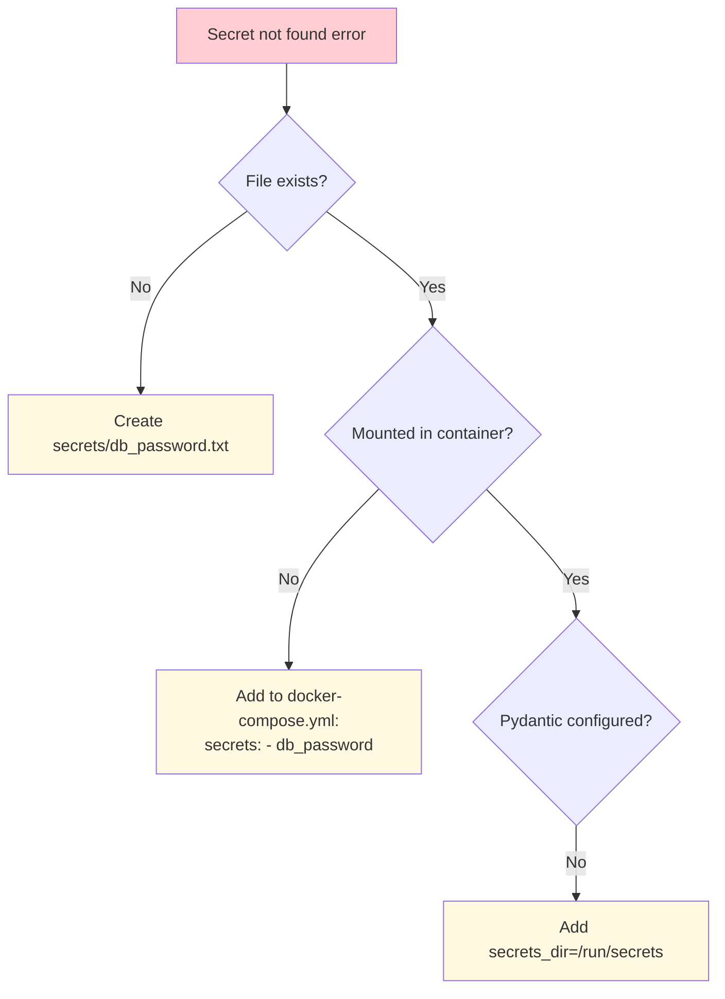

**Check secret mount:**

```bash
docker-compose exec project ls -la /run/secrets/
```

#### 3. Environment Variables Not Loaded

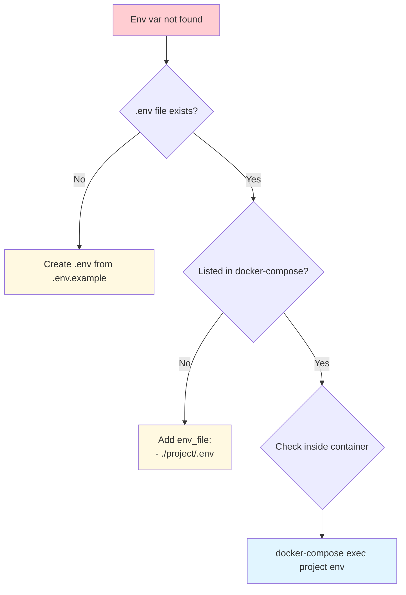

**Debug environment variables:**

```bash
# Check what env vars the container sees
docker-compose exec project printenv

# Check specific variable
docker-compose exec project printenv DATABASE_HOST
```

#### 4. Port Already in Use

```bash
Error: bind: address already in use
```

**Solution:**

```bash
# Find process using port 5003
lsof -i :5003
# or
sudo netstat -tulpn | grep 5003

# Kill the process or change port in docker-compose.yml
ports:
  - "5004:5003"  # Map to different host port
```

#### 5. Volume Permission Issues

```bash
Error: permission denied
```

**Solution in Dockerfile:**

```dockerfile
# Create non-root user
RUN useradd -m -u 1000 appuser

# Change ownership
COPY --chown=appuser:appuser /src ./src/

# Switch to user
USER appuser
```

---

## Docker Commands Reference

### Build and Run

```bash
# Build images
docker-compose build

# Build without cache
docker-compose build --no-cache

# Start services
docker-compose up

# Start in background (detached)
docker-compose up -d

# Build and start
docker-compose up --build

# Start specific service
docker-compose up db
```

### Stop and Remove

```bash
# Stop services
docker-compose stop

# Stop and remove containers
docker-compose down

# Stop, remove containers AND volumes (⚠️ deletes data!)
docker-compose down -v

# Remove specific service
docker-compose rm project
```

### Logs and Debugging

```bash
# View logs
docker-compose logs

# Follow logs in real-time
docker-compose logs -f

# Logs for specific service
docker-compose logs -f project

# Last 100 lines
docker-compose logs --tail=100 project

# Execute command in running container
docker-compose exec project bash

# Run one-off command
docker-compose run project python -c "from src.core.settings import settings; print(settings.DATABASE_URL)"
```

### Inspect and Debug

```bash
# List running containers
docker-compose ps

# Inspect service
docker-compose exec project env

# Check network
docker network ls
docker network inspect sdlc_default

# Check volumes
docker volume ls
docker volume inspect sdlc_pgdata

# View container details
docker inspect sdlc-app
```

### Database Operations

```bash
# Connect to PostgreSQL
docker-compose exec db psql -U postgres -d inventory_manager

# Run SQL file
docker-compose exec -T db psql -U postgres -d inventory_manager < schema.sql

# Backup database
docker-compose exec db pg_dump -U postgres inventory_manager > backup.sql

# Restore database
docker-compose exec -T db psql -U postgres inventory_manager < backup.sql
```

---

## Security Best Practices

### 1. Never Commit Secrets

```bash
# .gitignore
.env
.env.*
!.env.example
secrets/
*.pem
*.key
```

### 2. Use Non-Root User

```dockerfile
RUN useradd -m -u 1000 appuser
USER appuser
```

### 3. Minimize Image Size

```dockerfile
# Use slim images
FROM python:3.12-slim

# Multi-stage builds
FROM python:3.12 as builder
# Build dependencies
FROM python:3.12-slim as runtime
# Copy only what's needed
```

### 4. Read-Only Secrets

```yaml
secrets:
  db_password:
    file: ./secrets/db_password.txt
    # Secrets are always mounted read-only
```

### 5. Network Isolation

```yaml
networks:
  frontend:
    # Public-facing services
  backend:
    internal: true # Not accessible from outside
```

---

## Production Deployment Checklist

- [ ] Remove development-only configurations
- [ ] Use environment-specific `.env` files
- [ ] Set proper resource limits
- [ ] Configure restart policies
- [ ] Set up log aggregation
- [ ] Use health checks
- [ ] Implement monitoring
- [ ] Use secrets management (Vault, AWS Secrets Manager)
- [ ] Set up backups for volumes
- [ ] Use orchestration (Kubernetes, Docker Swarm)
- [ ] Implement CI/CD pipeline
- [ ] Security scanning of images

---

## Conclusion

This Docker setup provides:

✅ **Security**: Secrets never in source code or images  
✅ **Portability**: Runs identically everywhere  
✅ **Isolation**: Each service in its own container  
✅ **Persistence**: Data survives container restarts  
✅ **Networking**: Services communicate securely  
✅ **Scalability**: Easy to add more services  
✅ **Development**: Quick local setup  
✅ **Production-Ready**: With proper configurations

---

## Further Reading

- [Docker Documentation](https://docs.docker.com/)
- [Docker Compose Documentation](https://docs.docker.com/compose/)
- [Pydantic Settings](https://docs.pydantic.dev/latest/concepts/pydantic_settings/)
- [PostgreSQL Docker Hub](https://hub.docker.com/_/postgres)
- [FastAPI Deployment](https://fastapi.tiangolo.com/deployment/)
