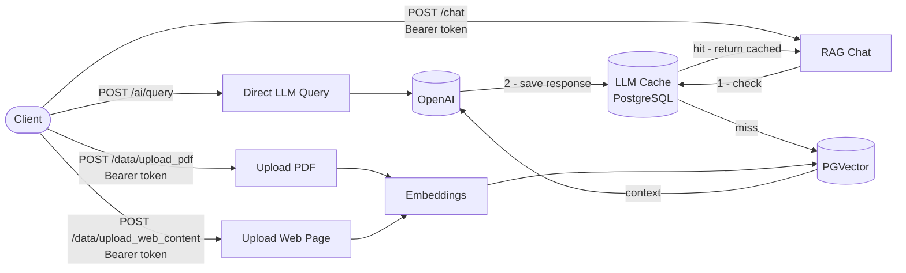

# Multi-Tenant RAG API

## Description

A serverless FastAPI application that lets authenticated users upload documents (PDFs and web pages), then query that content using an LLM. Each user's data is isolated — embeddings, cache, and retrieval are all scoped to the authenticated user.

Built on FastAPI + PostgreSQL + PGVector. Deployable to AWS Lambda via SAM.

---

## Prerequisites

- Python 3.12
- PostgreSQL with the `pgvector` extension enabled
- OpenAI API key
- AWS account (for production deployment)

**Database setup** — create the `vector_db` database and enable the `pgvector` extension:

```bash
# Connect to PostgreSQL as superuser
psql -U postgres

# Inside psql:
CREATE DATABASE vector_db;
\c vector_db
CREATE EXTENSION IF NOT EXISTS vector;
\q
```

> If `pgvector` is not installed, download the installer for your PostgreSQL version from [github.com/pgvector/pgvector](https://github.com/pgvector/pgvector/releases) or install it via Stack Builder (included with PostgreSQL on Windows).

**Local development** — create `locals.json` in the project root:

```json
{
  "MainFunction": {
    "OPENAI_API_KEY": "sk-...",
    "POSTGRESQL_PWD": "your_db_password",
    "JWT_SECRET_KEY": "your_jwt_secret"
  }
}
```

**Install dependencies:**

```bash
pip install -r requirements.txt
```

**Run migrations:**

```bash
alembic upgrade head
```

**Start the server:**

```bash
uvicorn src.api.main:app --reload
```

---

## Architecture



---

## Project Structure

```
src/
├── api/
│   ├── main.py              # App entry point + Lambda handler (Mangum)
│   └── routes/
│       ├── user.py          # /user/register, /user/login
│       ├── ai.py            # /ai/query
│       ├── chat.py          # /chat
│       └── data.py          # /data/upload_pdf, /data/upload_web_content
├── core/
│   ├── ai_utility.py        # RAG chains, LLM client, token cost, history
│   ├── cache.py             # LLM response cache (read/write)
│   ├── config.py            # App lifespan, constants, text splitter
│   ├── database.py          # SQLAlchemy engine + session
│   ├── database_utility.py  # All DB operations (auth, embeddings, hashing)
│   ├── jwt.py               # Token creation + decoding
│   ├── jwt_utility.py       # FastAPI auth dependency
│   ├── prompts.py           # SYSTEM, CONTEXTUALIZE, QA prompts
│   ├── utility.py           # Hashing, timing, password utils
│   └── secrets/             # Secret loading (local JSON or AWS Secrets Manager)
├── models/
│   ├── user.py              # User ORM model
│   └── cache.py             # UserLLMCache ORM model
└── schema/
    ├── user.py              # Pydantic: UserCreate, UserLogin
    ├── ai.py                # Pydantic: Query, WebLink
    ├── token.py             # Pydantic: TokenData
    └── response.py          # Pydantic: APIResponse
```

---

For architecture diagrams, endpoint details, and database schema, see [docs/api-reference.md](docs/api-reference.md).
